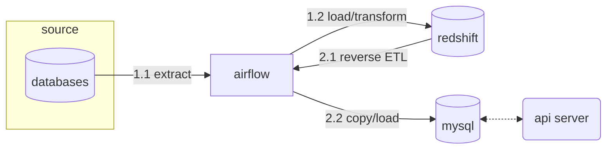

---
{"author":"jx2lee","aliases":"DW 데이터 서빙을 위한 API 개발","created":"2025-09-02T22:31:10.310+09:00","last-updated":"2025-09-02 22:31","tags":null,"project":{"include":true,"status":"done","root":true,"company":"Bithumb","duration":"2025.06 - 2025.07"},"dg-publish":true,"dg-home-link":false,"dg-show-local-graph":true,"dg-show-backlinks":true,"dg-show-toc":false,"dg-show-inline-title":true,"dg-show-file-tree":false,"dg-enable-search":true,"dg-link-preview":true,"dg-show-tags":false,"dg-pass-frontmatter":false,"permalink":"/career/projects/api-serving/","dgShowBacklinks":true,"dgShowLocalGraph":true,"dgShowInlineTitle":true,"dgEnableSearch":true,"dgLinkPreview":true,"dgPassFrontmatter":true,"noteIcon":""}
---

### background

빗썸에는 본인의 자산을 담보로 코인을 대여할 수 있는 [코인대여 서비스](https://www.bithumb.com/react/lending-plus/quiz)를 운영하고 있습니다. 서비스 이용에 만족하는 조건(지난 3년간 누적거래금액에 따른 대여한도)이 필요했고, 이를 서비스 운영 데이터이터베이스에서 집계하기 어려운 문제가 있었어요.

- 코인대여 서비스를 신청하기 위한 조건: 지난 3년 빗썸에서 거래한 누적거래금액 구간에 따라 대여할 수 있음. 천 만원 아래의 경우 서비스 신청이 불가함
- 서비스 개발 요구사항: 회원 별 지난(집계 기준) 3년간 누적거래금액 집계금액이 필요

### objective
- 회원 별 3년간 누적거래금액을 제공한다.
- 회원 별 3년간 누적거래금액은 조회시점 기준 09:00 시 이후에는 전날 집계기준 거래금액을 확인할 수 있어야 한다.

### howto

- 집계 데이터 생산은 `airflow` 에 위임했습니다.
    - 컴퓨팅 파워가 강한 DW 에 집계데이터를 생산하기 위해 Airflow 를 이용했습니다.
    - 배치는 새벽 시간대 실행되며, 배치 실행 시간 <> 1시간 이내 완료하지 못하는 경우 알람을 발생하여 대응할 수 있도록 구성하였습니다. 
- DW 로 이용중인 redshift 에 직접 커넥션을 맺지 않고 서빙 용도로 생성한 rdbms 로 reverse ETL 을 수행합니다.
    - 왜 Redshift 에 제공하지 않았나요?
        - 서비스와 밀접한 API 가 DW 에 바로 조회, 제공하는 경험이 부족했습니다. `API 가 붙은 대상이 RDBMS > DW 로 바뀌는 거 아니야?` 같이 단순해보일 수 있지만 통신을 위한 준비(방화벽)가 미흡했고 `서비스 데이터베이스를 데이터웨어하우스를 이용한다고?` 라는 물음표가 있었어요.
        - OLAP 엔진에 단순 조회쿼리를 실행하는 경우 RDBMS 보다 나은 성능을 제공할 수 없을거라 생각했습니다. 총 회원이 천만인 거래소에서 사용자가 몰리는 경우 Redshift 는 **동시성 쿼리 제한**으로 사용자 경험을 해칠 위험이 있었어요. (단, 백엔드 API 의 경우 한 시간 내 접근하는 경우 레디스로 캐싱하는 로직이 있어요)
    - 이러한 이유로 우리가 만들 API 가 붙는 RDBMS 인 mysql 로 리버스 ETL 과정을 추가했습니다. 단, 조회성능이나 관리를 위해 서비스 DB 의 데이터 수명은 집계 날짜 기준 일주일 로 설정했어요.
- EC2(auto scale group) 에 FastAPI 를 통해 백엔드 개발팀이 사용할 수 있는 API 를 제공합니다.
    - 아쉽지만, 컨테이너 환경에서 서비스를 운영하고 있지 않습니다. 다만, 트래픽에 따라 스케일 아웃이 가능한 ASG 로 구성된 EC2 에 API 를 배포하고 운영해요.
    - API 는 비동기워커(Unicorn) 로 구성, gunicorn 을 이용해 워커 프로세스를 관리했어요. 저사양 스펙에 고성능을 제공하기 위해 비동기 워커를 선택했고, 서버스펙에 맞는 워커수를 설정했어요.
    - 제공한 엔드포인트는 사실 간단했어요. 유저 ID > path parameter | 집계기준 날짜 > query parameter 로 받아 특정 유저의 누적거래금액을 반환해요. 

### result

### keytakeaway

### more
- [[career/projects/api-enhancement\|DW API w/ Arrow Flight SQL]]: 계획중