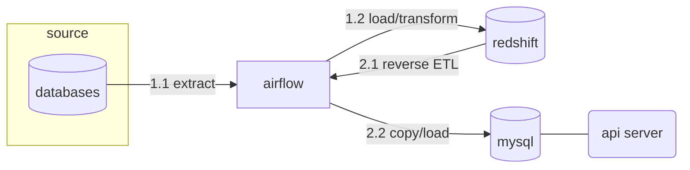

---
{"author":"jx2lee","aliases":"Data API","created":"2025-09-02T22:31:10.310+09:00","last-updated":"2025-09-02 22:31","tags":null,"project":{"include":true,"status":"done","root":true,"company":"Bithumb","duration":"2025.06 - 2025.07"},"dg-publish":true,"dg-home-link":false,"dg-show-local-graph":true,"dg-show-backlinks":true,"dg-show-toc":false,"dg-show-inline-title":false,"dg-show-file-tree":false,"dg-enable-search":true,"dg-link-preview":true,"dg-show-tags":false,"dg-pass-frontmatter":false,"permalink":"/career/projects/data-api/","dgShowBacklinks":true,"dgShowLocalGraph":true,"dgEnableSearch":true,"dgLinkPreview":true,"dgPassFrontmatter":true,"noteIcon":""}
---

### background
- 거래소 서비스에 컴퓨팅 파워가 큰 집계 데이터가 필요해졌습니다. 예를 들어, 사용자 별 최근 3년 치 거래금액 등 이 서비스에 필요했어요. 이를 OLTP 에서 수행하기엔 다른 서비스에 영향을 줄 수 있었어요.
- 이에 데이터팀은 DW 컴퓨팅 파워를 이용해 거래소 서비스에 필요한 데이터를 집계하고 이를 제공하는 API 를 만들었어요.

### objective
- 신뢰할 수 있는 집계 데이터를 제공합니다.
- 서비스 DB 에서 부담스러운 컴퓨팅 작업을 데이터웨어하우스에 위임합니다.

### howto

- 집계 데이터 생산은 `airflow` 에 위임했습니다.
    - 컴퓨팅 파워가 강한 DW 에 집계데이터를 생산하기 위해 Airflow 를 이용했습니다.
    - 배치는 새벽 시간대 실행되며, 배치 실행 시간 <> 1시간 이내 완료하지 못하는 경우 알람을 발생하여 대응할 수 있도록 구성하였습니다. 
- DW 로 이용중인 redshift 에 직접 커넥션을 맺지 않고 서빙 용도로 생성한 rdbms 로 reverse ETL 을 수행합니다.
    - 왜 Redshift 에 제공하지 않았나요?
        - 서비스와 밀접한 API 가 DW 에 바로 조회, 제공하는 경험이 부족했습니다. `API 가 붙은 대상이 RDBMS > DW 로 바뀌는 거 아니야?` 같이 단순해보일 수 있지만 통신을 위한 준비(방화벽)가 미흡했고 `서비스 데이터베이스를 데이터웨어하우스를 이용한다고?` 라는 물음표가 있었어요.
        - OLAP 엔진에 단순 조회쿼리를 실행하는 경우 RDBMS 보다 나은 성능을 제공할 수 없을거라 생각했습니다. 총 회원이 천만인 거래소에서 사용자가 몰리는 경우 Redshift 는 **동시성 쿼리 제한**으로 사용자 경험을 해칠 위험이 있었어요. (단, 백엔드 API 의 경우 한 시간 내 접근하는 경우 레디스로 캐싱하는 로직이 있어요)
    - 이러한 이유로 우리가 만들 API 가 붙는 RDBMS 인 mysql 로 리버스 ETL 과정을 추가했습니다. 단, 조회성능이나 관리를 위해 서비스 DB 의 데이터 수명은 집계 날짜 기준 일주일 로 설정했어요.
- EC2(auto scale group) 에 FastAPI 를 통해 백엔드 개발팀이 사용할 수 있는 API 를 제공합니다.
    - 아쉽지만, 컨테이너 환경에서 서비스를 운영하고 있지 않습니다. 다만, 트래픽에 따라 스케일 아웃이 가능한 ASG 로 구성된 EC2 에 API 를 배포하고 운영해요.
    - API 는 비동기워커(Unicorn) 로 구성, gunicorn 을 이용해 워커 프로세스를 관리했어요. 저사양 스펙에 고성능을 제공하기 위해 비동기 워커를 선택했고, 서버스펙에 맞는 워커수를 설정했어요.
    - 제공한 엔드포인트는 사실 간단했어요. 유저 ID > path parameter | 집계기준 날짜 > query parameter 로 받아 특정 유저의 누적거래금액을 반환해요. 
 

### keytakeaway
- 회사 메인 도메인 중 하나인 거래소 서비스에 데이터를 제공했습니다.
- DW 테이블만 제공했던 이전과 달리, Reverse ETL 파이프라인과 API 개발로 하나의 큰 라이프 사이크를 경험했습니다.

### more
- [[api-serving__01\|회원별 누적거래금액 API]]