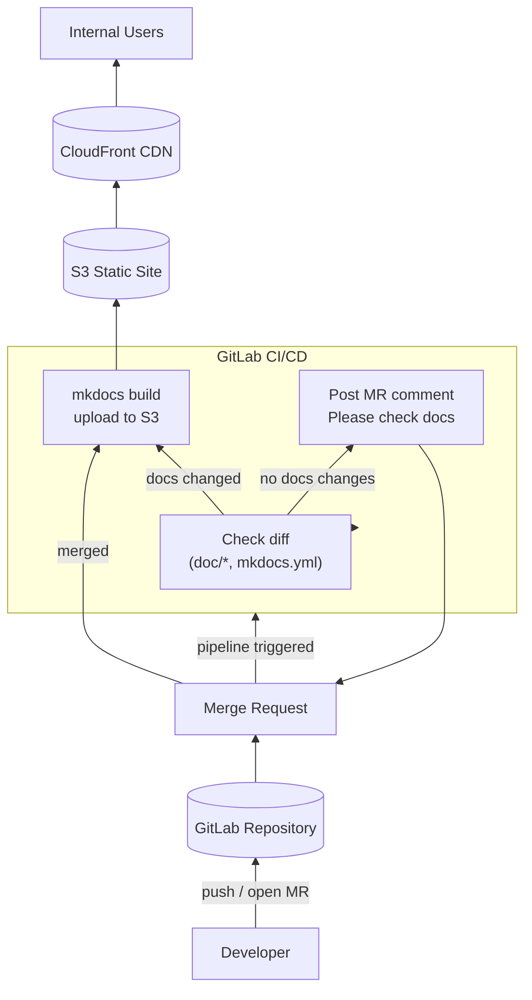

---
{"author":"jx2lee","aliases":"Software Architecture Document 기반 데이터 플랫폼 문서체계 마련","created":"2025-10-26T21:44:17.000+09:00","last-updated":"2025-10-26 21:44","tags":null,"project":{"include":true,"status":"done","company":"bithumb","duration":"2025.10 - 2025.11"},"dg-publish":true,"dg-home-link":false,"dg-show-local-graph":false,"dg-show-backlinks":false,"dg-show-toc":false,"dg-show-inline-title":false,"dg-show-file-tree":false,"dg-enable-search":false,"dg-link-preview":true,"dg-show-tags":false,"dg-pass-frontmatter":false,"permalink":"/career/projects/sad-data-platform/","dgLinkPreview":true,"dgPassFrontmatter":true,"noteIcon":""}
---

### background
- 데이터 플랫폼의 구성요소가 증가하고, Airflow·Kafka·Debezium·Iceberg·DataHub 등 다양한 오픈소스와 내부 모듈이 결합되면서 플랫폼 전체 구조를 일관된 기준으로 설명하고 공유하기 어려웠어요.  
- 특히 운영·대응·표준화·기술 의사결정이 개인 경험에 의존해 “왜 이 구조인가?”, “어디에 어떤 책임이 있는가?”를 명확히 답변하기 어려운 상태였어요.
- 또한, 신규 엔지니어 온보딩 시 플랫폼 구조(파이프라인, 메타데이터, 모니터링, CI/CD)가 산발적 문서에 흩어져 있어 **학습 비용 증가와 장애 대응 속도 저하** 문제가 있었어요.

### objective
- 데이터 플랫폼 전체를 설명하는 **일관된 아키텍처 문서(SAD)** 체계.
- 품질속성(QA) 기반 의사결정 기록(ADR)을 통해 “왜 이 기술을 선택했는가?” 명시
- 기여자·운영자·신규 엔지니어가 쉽게 접근 가능한 **문서 허브(mkdocs + S3)** 구성
- 문서/구조/프로세스 표준화로 **운영 안정·가시·온보딩 비용 개선**

### howto
#### SAD 템플릿 정의 (SEI Software Architecture Document 기반)
- 카네기 멜론대 SEI SAD Viewpoint(모듈·C&C·배포·운영 뷰)를 데이터 플랫폼에 맞게 커스텀
- Airflow, Kafka Connect, Debezium, Iceberg, DataHub, CI/CD 각각을 **Component / Deployment Level** 로 구조화  

#### ADR(Architecture Decision Record) 도입
- 품질속성(Availability, Observability, Scalability, Operability) 기반의 의사결정 기록  
- 예:  
  - Kafka Connect 선택 이유  
  - Debezium 스냅샷/락 정책 결정 
  - Iceberg vs Delta vs Hudi 비교  
  - Redshift/Airflow 멀티 클러스터 선택 이유
- 신규 기능 도입 시 ADR 템플릿 기반으로 일관된 기록 축적
- 스크립트로 쉽게 넘버링 문서를 생성하는 도구 개발

#### 문서 플랫폼 구축 (mkdocs + GitLab CI/CD + S3)
- 문서 저장소 구성 후 mkdocs-material 이용
- Gitlab CI/CD 로 정적 페이지 자동 빌드 및 S3 배포  
- CloudFront를 통해 사내 전 직원이 접근 가능한 형태로 제공  

### keytakeaway
- **운영 안정성과 조직 생산성은 문서화 품질에 비례한다**는 점을 명확히 체감했어요. 플랫폼 구성요소가 늘어날수록 “코드보다 문서/아키텍처 관리”가 더 큰 임팩트를 만들어내는 걸 확인했어요. (그래도 무엇보다 코드가 제일 중요)
- SEI SAD + ADR 조합은 빠르게 변하는 기술 환경에서도 “왜 이 구조인가?”를 설명할 수 있는 체계를 만들었어요. 누군가 `이걸 왜 도입했어요?`  라는 질문에 `익숙해서요` 가 아닌 ADR 몇번 보세요. 라고 답할 수 있었어요.
- mkdocs 기반 문서 포털 도입으로 신규 엔지니어 온보딩, 장애 대응, 기술 의사결정 품질이 크게 향상했어요. 더이상 온보딩에 불필요한 리소스를 쓰지 않아도 돼요.
- 향후 데이터 프로덕트 스펙(스키마, 품질 규칙, SLA)과 연계해 **엔지니어링 + 데이터 거버넌스 통합 문서체계**로 확장할 계획이에요.

### more
None