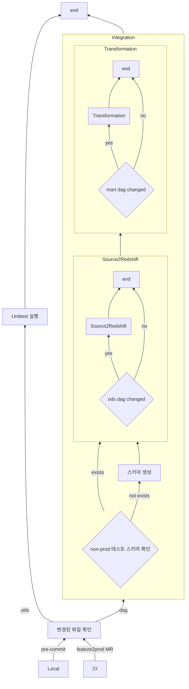

---
{"author":"jx2lee","aliases":"신뢰성 있는 Airfow dag Repository 를 위한 여정","created":"2025-07-13T18:04:45.000+09:00","last-updated":"2025-07-13 18:04","tags":["airflow","test","ci","internal"],"project":{"include":false,"status":"doing","company":"Bithumb","duration":null},"dg-publish":true,"dg-home-link":false,"dg-show-local-graph":false,"dg-show-backlinks":false,"dg-show-toc":false,"dg-show-inline-title":false,"dg-show-file-tree":false,"dg-enable-search":false,"dg-link-preview":true,"dg-show-tags":false,"dg-pass-frontmatter":false,"permalink":"/data/airflow/__/test-environment/","dgLinkPreview":true,"dgPassFrontmatter":true,"noteIcon":""}
---

### background

### objective

### howto
**Component Diagram**

### result

### keytakeaway

### more