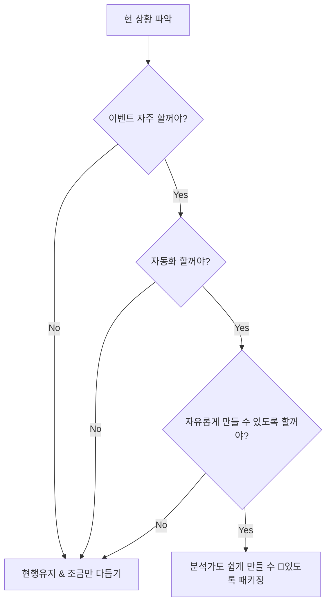

---
{"dg-publish":true,"permalink":"/data/dbt/__/dbt-braze-cdi-integration/","tags":["dbt","cdi","custom_attribute"],"dgHomeLink":true,"dgShowLocalGraph":true,"dgEnableSearch":true,"dgLinkPreview":true,"noteIcon":"","created":"2024-09-02T20:58:04.000+09:00"}
---


> [!info] cdi attribute 를 현재 dbt 로 어떻게 활용하고 있는지, 어떻게 개선해나갈지 공유한다.

### Current Status
**model mangement**
- models/braze/event_win 폴더 아래로 attribute 모델을 관리하고 있습니다. {placeholder} 이벤트에 사용할 어트리뷰트가 많아(본 이벤트의 경우 4개) 따로 폴더로 분류하였습니다.
- 각 모델의 의존성(부모/자식은 누구인지)은 README 에 작성해두었습니다. 이벤트 참여 조건을 만족하는 common 모델이 상위 부모로 두고 파생되는 형태를 가집니다.
- 동일 이벤트를 차수를 나눠 진행하는 경우 start/end_ts 파라미터의 타임스탬프 값을 계속해서 수정해야 합니다(이벤트 코드가 변경되는 경우 -> 이벤트 코드 파라미터도 변경해야 합니다). 
```
# tree
braze/
├── cdi.md
├── cdi_attribute.sql
├── cdi_attribute.yml
...
└── event_win
    ├── README.md
    ├── cdi_attribute__event_win__krw_transfer.sql
    ├── cdi_attribute__event_win_coin.sql
    ├── cdi_attribute__event_win_coin.yml
    ├── cdi_attribute__event_win_common.sql
    ├── cdi_attribute__event_win_pnl.sql
    ├── cdi_attribute__event_win_pnl.yml
    ├── cdi_attribute__event_win_required.sql
    ├── cdi_attribute__event_win_required.yml
    ├── cdi_attribute__event_win_winner.sql
    └── cdi_attribute__event_win_winner.yml
```


**cdi_attributes management**
- 이벤트에 사용할 어트리뷰트를 추가하려면, Braze CDI 가 바라보는 테이블 cdi_attributes 의 `attribute_models` 에 추가할 어트리뷰트를 작성해야 합니다.
- 여러 이벤트의 attribute 들을 관리하고 있습니다. 현재 has_first_order/event_5m/event_win 3가지 이벤트의 어트리뷰트들을 주입하고 있습니다.
- 이벤트 별 updated_at 이 모두 다르게 관리됩니다. event_win 의 경우 `timestamp_add(timestamp_trunc(max(c.updated_at) over(), day, 'Asia/Seoul'), interval 24*60*60-1 second) as updated_at` 으로 max(이벤트 참여 조건 시점, 이벤트 코드 등록 시점) + 24\*60\*60-1 을 사용하고 있습니다 . {has_first_order} 는 이러한 장치가 없구요.
    - 모두 다르다보니.. cdi sync 시 updated_at 작업에 조금 헷갈리더라구요. 같이 묶여 관리한다면 동일하게 관리되면 좋겠단 생각이 들었어요.
- (의도하신거지만) 어트리뷰트 모델의 각 value 에 대한 null 테스트가 존재합니다. null 로 값을 설정하는 경우 브레이즈 싱크 시 어트리뷰트를 삭제합니다. 이벤트 마다 성격이 다르겠지만, 조건에 해당하지 않는 유저의 어트리뷰트를 삭제할 경우가 존재합니다.
    - e.g BTC를 이겨라 이벤트의 경우 도중 API 로 거래 시 이벤트에 참여할 수 없습니다.


**결론**
- 이벤트 차수 넘어갈 때 마다 코드 변경이 필요합니다. 다음 차수 이벤트 시작 날 코드 변경하고 푸시하는 번거로움이 존재합니다. 그리고 이전 차수 주입된 어트리뷰트 삭제도 필요하구요.
    - 어트리뷰트 초기화는 수작업으로 하고 있었어요.
    - 빅쿼리 콘솔에서 어트리뷰트 null & updated_at 최신화 -> Braze 수동 싱크
- 진입장벽이 높습니다. 이벤트 모델을 생성하지 않은 사람들이 처음 모델링 할 때 많이 혼란스러울 것으로 예상합니다. 저 또한 그랬구요.
- 이벤트 마다 성격이 다름 -> 같은 어트리뷰트 모델(cdi_attribute) 로 관리되고 있습니다. Braze CDI 화면에서도 동일한 CDI 로 여러 이벤트를 관리하는 것은 효율적이지 못한 구성으로 생각해요.
    - 이벤트 와 cdi_attribute 모델의 관계는 1:1 이 이상적이라 생각합니다. 이벤트가 중지/유지 될 경우 유지보수도 쉬울 것 같고, 다만 이벤트가 많아지면 기대한 장점이 상쇄될 것 같아요.




### Alternatives
#### 현행 유지 (덧대기)
**pros**
- 지금 만들어진 구조에 조금만 수정하면 됩니다 -> 작업공수가 많이 들지 않습니다.
    - 수정할 부분: 어트리뷰트 삭제하기 위한 장치(모델)가 필요합니다. null 허용, 기간 이후 각 어트리뷰트의 값을 null 로 생성하기 등이 있을 것 같구요, 구현 방법은 조금 더 고민이 필요합니다.

**cons**
- 추후 이벤트가 많아진다 -> 관리가 어렵습니다. event_win 이벤트만 하더라도 어트리뷰트 모델이 4개 이고, 이벤트 조건에 해당하지 않은 유저 혹은 이전 차수 이벤트 어트리뷰트 삭제는 수동으로 대응하고 있습니다. -> 손이 많이 갑니다.
- 진입장벽이 높다 생각합니다. 위에서도 언급했지만 사실 시간들여 파보면 금방 할 수 있는데요, 사용자에게 인터페이스를 제공(내부 동작을 몰라도 원하는 모델을 생성할 수 있는 추상화된) 하고 싶었어요. 이전에 사용했던 dbt-metrics 패키지 처럼요.


#### Building dbt packages
**pros**
- README 만 참고하면 어트리뷰트 모델을 생성할 수 있습니다. (Readme Driven Development)
- 정해진 틀 안에서 자유롭게 어트리뷰트 모델을 생성할 수 있습니다. 아직 구체적인 설계/구현은 진행하지 않았지만, `cdi.generate` 와 같은 매크로 함수를 통해 베이스 모델 및 주입할 어트리뷰트 값을 갖는 모델을 자동으로 생성할 예정입니다.

```sql
select *
from {{ cdi_attribute.generate(
    base_query={}
    attribute_name={},
    arg2={value2},
    ...
) }}
```

- 대략 이런 형식을 생각했습니다. 사용자가 쉽고 빠르게 이용할 수 있도록 구조는 어떻게 할지 결졍되면 이슈파고 진행해볼게요.
- 위 쿼리 작성 시 베이스 모델/어트리뷰트/value조건 등을 아규먼트로 받아 자동생성하는 걸 생각했습니다. 
    - 예를들어 `(캠페인 대상자를 뽑아내는 쿼리파일, 어트리뷰트명)` 등을 입력값으로 받아 -> `(cdi_attribute__{이벤트}명 의 CDI가 바라보는 테이블, cdi_attribute__{이벤트}_{attribute_명}` 등의 테이블을 자동생성 하는 걸 생각했어요.
    - 이벤트 마다 조건이 다르기 때문에 표준화된 인터페이스를 깊이 고민해야할 것 같아요. 좋은 아이디어 있으면 과감히 던져주세요.

**cons**
- dbt 의존성이 높습니다: dbt 를 버리지 않는다면 큰 문제가 되진 않을거라 생각합니다.
- 패키지를 만들어본 경험이 없습니다. 작업공수가 현행 유지 보단 조금 더 사용될거라 예상합니다.
    - [dbt-metrics](https://github.com/dbt-labs/dbt_metrics) 패키지 참고할 예정입니다.

### In My Opinion
- **패키징 하고 싶어요.**
    - 왜요? -> 앞으로 브레이즈를 활용한 이벤트가 늘어날 것으로 예상/기대 하고 있습니다. 그런만큼 미리 패키징 해두면 편리할 것 같구요, [dbt package hub](https://hub.getdbt.com) 보시면 브레이즈 관련된 패키지는 없어요. 이거 만들고 오픈소스화 하는 작업도 하면 재밌을 것 같아요. (개인적인 희망)
- 생각해본 선택지는 다음과 같습니다.
    1. (좁은 범위의) 매크로 조합으로 이벤트 모델 관리하기
        - 생각해보고 싶지 않은 선택지 라고 생각합니다. 매크로 단위로 관리하면 유지보수가 지금이랑 크게 다르지 않을 것 같아요.
    2. (넓은 범위의) dbt package 로 관리하기
        - 단, 관리차원에서 dbt-metric 레포 내 submodule 로 관리하여 dbt deps 시 로컬 패키지 이용할 수 있도록 구성하고자 합니다.
        - 괜히 repo 따로 관리하면 dbt deps 시 작업이 조금 귀찮아져요. (외부 레포로 공유 시에는 remote 등록 후 관리 가능한 지 확인해야봐야 합니다. -> 위에서 이야기한 오픈소스화 하는 방법 이야기)


### todo
- 결정하기(그냥 있는대로 삽시다vs패키징하기)
- 일정 대략 예측해보기(BTC이겨라 이벤트 3차 진행 혹은 윤지님 검토중인 CRM 캠페인 이전까지 준비할지 결정하기)
