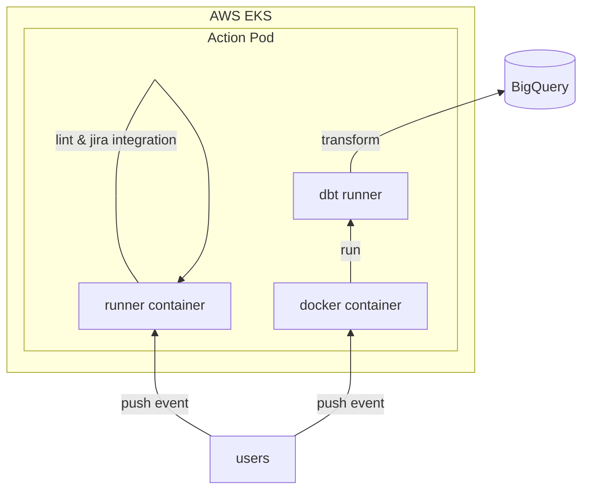

---
{"dg-publish":true,"permalink":"/data/dbt/__/dbt-cicd-pipeline/","tags":["dbt","cicd"],"dgLinkPreview":true,"noteIcon":"","created":"2024-10-02T18:51:46.477+09:00"}
---

> [!info]
> dbt CI/CD 파이프라인 개선 프로젝트

### background
- 2023년 상반기부터 github enterprise(ghe) 도입을 계획 & 하반기에 적용해야 했습니다.
- 기존 Atlassian bamboo & Airflow 를 조합한 ci/cd 파이프라인은 여러 단점들이 존재했습니다. 직접적인 서비스 영향도가 적은 데이터 조직에서 먼저 이관을 결정하게 되었습니다.
	- 단점들: 낮은 사용자 경험(Airflow 이용 경험이 적음), 빌드 결과를 확인하기 까지 많은 홉(stash -> bamboo deployment -> airflow DAG)

### objective
- 기존 파이프라인과 동일한 기능을 제공합니다.
- 작업자의 사용자 경험을 높입니다.

### howto
system architecture

- branch push 이벤트 기반 워크플로우를 만들었습니다.
	- `dev/prod` 브랜치 푸시 이벤트가 발생하면 download s3(previous state) > build with select modified 커맨드를 실행하는 워크플로우가 실행됩니다.
	- 현재는 변경된 모델의 자식모델을 모두 빌드하는데 이는 비효율적이라 PR 과정 혹은 빌드과정에 특정 자식 모델들만 선택해 빌드하는 과정을 고민하고 있습니다. (`Github App or other backend`)
- [reviewdog](https://github.com/reviewdog/reviewdog) 과 같은 오픈소스, public action 을 활용해 다양한 워크플로우를 제공하였습니다.
	- Market Place 제공하는 액션을 우리 환경에 맞게 수정하였습니다.
	- 그리고 공용으로 자주 사용되는 워크플로우를 관리하기 위한 **action 전용 레포**를 구성하였습니다.

### result
- **full build/slim CI** 와 같은 기존 파이프라인에서 제공하던 기능을 문제 없이 이관하였습니다. cicd EKS 가 고장나지 않는 상황을 제외 (혹은 GHE 이슈), 빌드에 실패하지 않았습니다.
- Lint 액션, Jira 통합 워크플로우 추가로 더 나은 환경을 제공하였습니다. 사용자 경험을 높이기 위해 다양한 도구들을 지속적으로 제공하고 있습니다. (e.g `trigger jira & google calendar when reviewer assign event rises`)

### keytakeaway

- dbt 파이프라인을 Github Action 을 이용해 이관했어요.
- 새롭게 제공한 기능(Lint, Jira 통합 액션 등)으로 사용자(dbt 이용가능한) 경험을 향상시켰어요.

### more
- [[data/dbt/__/github-actions-in-data\|Improvement dbt CI/CD with Github Actions]]
