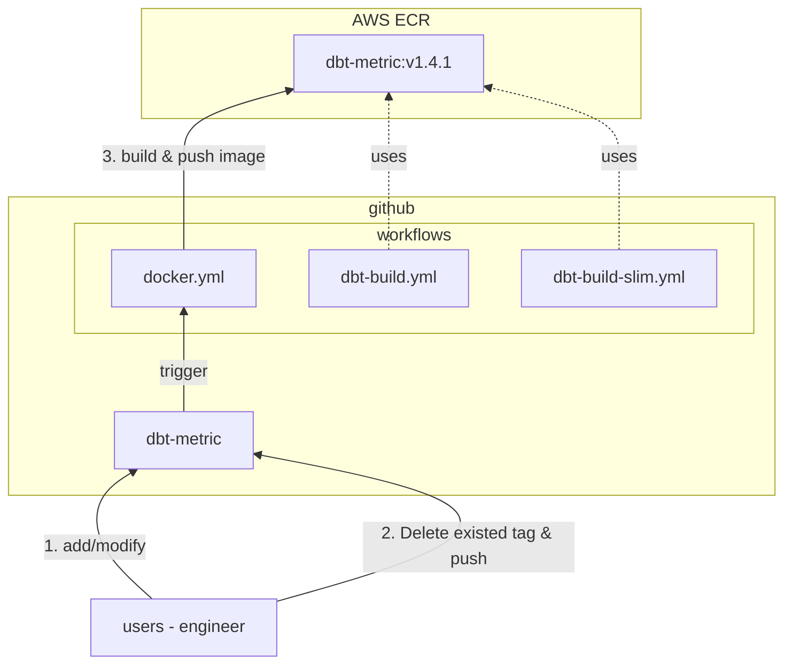
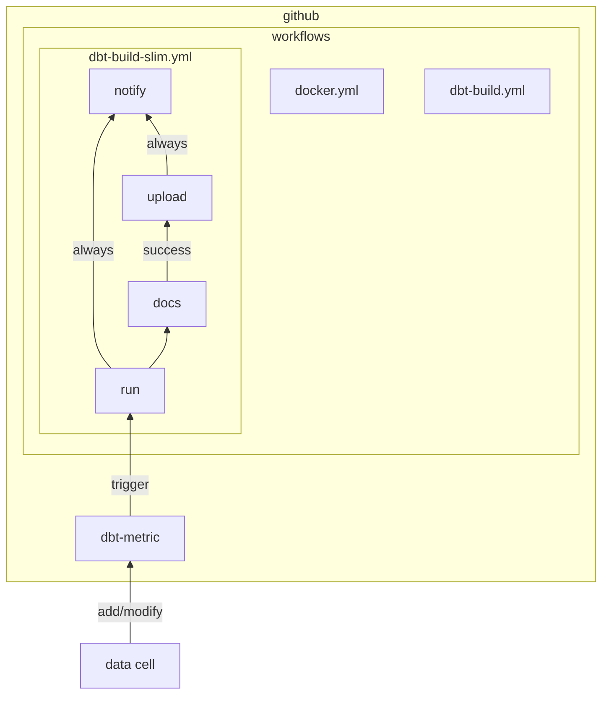

---
{"dg-publish":true,"permalink":"/data/dbt/__/dbt-image-in-pipeline/","tags":["dbt","image","pipeline"],"dgHomeLink":true,"dgShowBacklinks":true,"dgShowLocalGraph":true,"dgShowInlineTitle":true,"dgEnableSearch":true,"dgLinkPreview":true,"dgShowTags":true,"noteIcon":"","created":"2024-06-30T00:39:32.597+09:00"}
---

> [!info] 파이프라인에 사용중인 이미지를 개선하기 전 현재 상황을 파악하고 대안을 생각해본다.

### current status

dbt 파이프라인에 사용하는 이미지를 수정하는 과정을 다이어그램을 표현하면 다음과 같다.

1. 작업자는 dbt 커맨드를 실제 수행하는 `entrypoint.sh` 를 수정하고 dbt-metric 레포에 푸시한다. 
2. 이미지 버전은 dbt 버전을 따르기 때문에, upstream 에 생성된 tag 를 삭제한다. 이후 새로 생성
한 태그를 upstream 에 푸시한다.
3. 태그 생성 이벤트는 `docker.yml` 워크플로우를 트리거한다. 이 워크플로우는 tag 기준 이미지를 생성하고, ECR 에 푸시한다.

위 과정으로 생성된 이미지(**dbt-metric:v1.4.1**)는 `dbt-build.yml` & `dbt-build-slim.yml` 워크플로우에서 이용한다. 

### problem

1. 복잡성 증가
	- 사용중인 이미지 수정이 필요한 경우 수반되는 작업들이 많다. 변경 이미지로 테스트를 하는 경우, 기존 생성된 tag 를 삭제 & 생성 & 푸시하는 작업들이 반복된다. 이 작업은 이미지 버전을 dbt-core 버전에 맞추지 않고, 임의로 관리되는 버전을 사용하면 해결된다. 단, 임의로 관리되는 버전을 사용해도 수정 전파로 변경할 내용이 많아지는 건 막을 수 없다.
	- 이외에도 알람 기능을 추가/삭제 하는 경우에도 이미지 재 빌드가 필요하다. 우리가 정의한 작업(full/slim) 이 너무 많은 일을 담당하고 있다.
2. 낮은 가독성 (이미지 실행 스크립트)
	- 작업들을 함수 단위로 나누었지만 스크립트를 처음 보는 크루는 로직을 이해하기 어렵게 짜여져 있다. 더군다나 쉘 스크립트에 익숙하지 않은 크루가 수정을 해야하는 경우, 난감하다.
	- 스크립트 정리를 통해 가독성을 높일 수 있겠지만, repository 내 README 등 문서로 남겨놓고 관리하는 것도 하나의 방법인 것 같다. 지금 코드는 로직을 이해하기 어려울 정도로 가독성이 낮다.

### alternatives

스크립트(entrypoint) 정리
- 스크립트를 리팩토링 한다.
- 최초 생성 이후 수정 이력을 확인해보니, build 시 select/exclude args 수정이 많았다. 이를 이미지 내에서 관리하지 않고 Github Action 의 workflow 에서 변경하면 관리가 용이해질 것으로 기대한다.
- Pros
	- 낮은 의존성: 현재 dbt 파이프라인은 Github Action 워크플로우에서 실행한다. 혹여나 다른 도구(예를 들어 argo workflow 등) 로 옮겨가도 이미지 변경 작업은 없다.
	- 짧은 작업 완료시간: 다른 대안과 비교했을 때보다 새롭게 작성하는 것이 아닌 정리 작업이다. 따라서 작업 기간은 그리 길지 않을 것으로 기대한다.
- Cons
	- 관리 어려움(엔지니어 제외?): 코드는 결국 관리되어야 한다. 담당자가 변경될 경우(특히 분석가가 담당할 경우) 새로운 담당자는 쉘 스크립트에 익숙해야한다.

Github Action 으로 녹여내기

- 이미지에서 수행한 작업들을 Github Action 워크플로우에 녹여낸다. 기존 방식에서 이미지를 빌드하고 푸시하는 단계와, 태그를 생성하고 삭제하는 단계가 생략된다.
- 기존 이미지에서도 결국 dbt 커맨드를 실행한다. 각 커맨드 실행을 워크플로우의 job 으로 분리하는 방향으로 구현한다. 만약 커맨드 수정이 필요한 경우 workflow 만 수정하면 된다.
- Pros
	- 관리 용이성: 워크플로우 내 커맨드 라인 형식으로 사용될 경우, dbt 커맨드에 숙련도가 높은 분석가는 쉽게 파이프라인을 변경할 수 있다.
- Cons
	- 높은 의존성: Action Workflow 와 강결합된다. 따라서 만약 파이프라인 도구가 github 에서 변경된다면, 그에 따란 수정 전파가 대량 발생할 것으로 예상한다.
	- 높은 Action 숙련도: 파이프라인 내 모든 동작들을 워크플로우로 구현해야한다. 그만큼 중복되는 작업들이 증가할 것이고, 이에 대응하기 위한 시간과 노력이 필요하다. Action 을 위한 [GitHub 레포지토리](https://github.com/dbt-labs/actions)도 생성해야할 수 있다.

IMO
- problem 을 나열해보고, 대안들을 생각해본 결과 "이미지 관리 어려움(보기 힘들어요)" 로 정리됐다. 입사 후 바로 진행한 작업이기도 하고, 레거시 코드를 살펴보는 내가 자꾸 후회되고.. 자아 성찰의 시간을 갖기도 했다. 코드 정리 시간이 온 것 같다.
- 따라서 dbt 파이프라인에 사용하는 이미지를 개선하는 방향으로 기울었다(**Shell 스크립트 정리**). 또한, 다른 오픈소스 도구들 (CLI 어플리케이션이 아닌) 의 dockerfile 및 entrypoint 스크립트를 살펴보니, 다듬고 싶었다. 살펴본 오픈소스 중 [카프카](https://github.com/apache/kafka/tree/trunk/docker)는 세너티 테스트(Sanity Test) 를 파이썬으로 구현해두었다. 해보고 싶어졌다.
- 결론: 현재 파이프라인 수정 작업들과 문제점, 대안들을 생각해봤다. 스크립트 수정할 계획이다.

> 앞으로 계획
> - 해당 문서 셀 내 공유
> - 의견 확인
> - 이후 작업들 진행 (일감 세분화 > 티켓 생성 > 작업 진행)