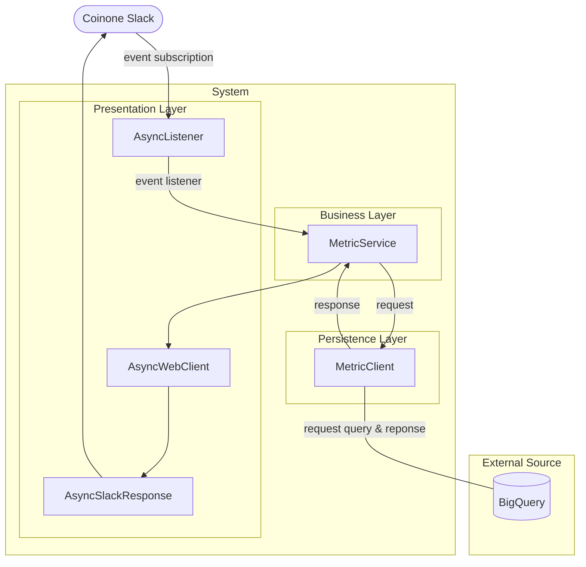
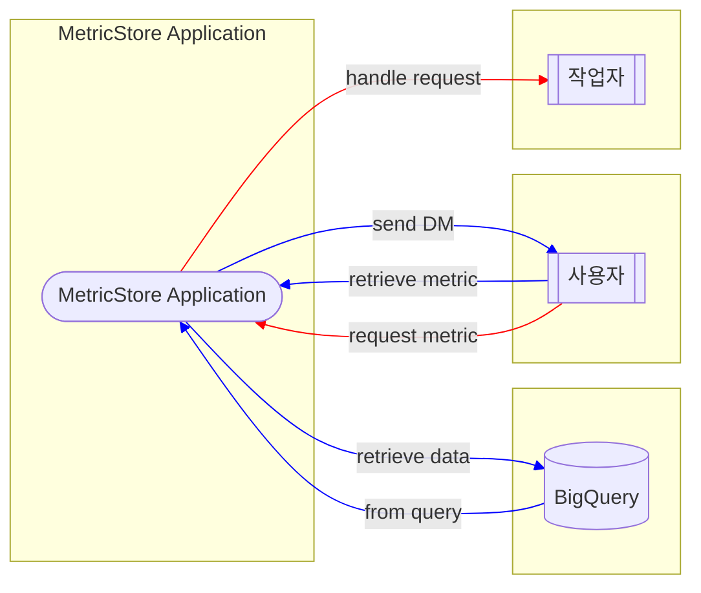

---
{"author":"jx2lee","alias":"SAD - CnC View","created":"2024-06-30T00:39:32.000+09:00","last-updated":"2023-12-27 23:53","tags":null,"dg-publish":true,"permalink":"/data/dbt/__/dbt-metricstore-sad-cnc-view/","dgPassFrontmatter":true,"noteIcon":""}
---

> [!tldr] Component and Connector View in MetricStore

### Primary Presentation

C&C 뷰로 분석한 MetricStore 시스템은 위 그림과 같이 Layered 패턴을 띄고 있다. 슬랙 봇과의 대화에서 사용한 슬래시 커맨드 이벤트를 받아 적절한 서비스를 호출한다. 지표를 생성하기 위한 클라이언트는 Persistent Layer 에 속하며 사용자가 원하는 지표를 생성할 수 있도록 쿼리를 생성하고 데이터 웨어하우스에 조회한다. 이렇게 조회된 결과는 슬랙 봇 과의 대화의 메세지로 전송하는 시스템이다.

### Element Catalog

`Coinone Slack`
- 코인원에서 사용하는 슬랙 워크스페이스 이다.
- 등록한 Metric Store 앱에서 발생한 이벤트를 발행하는 주체이다.

`AsyncListener`
- Bolt 프레임워크에서 슬랙 이벤트 발생 시 등록한 이벤트를 감지하는 클래스 이다.
- 다양한 리스너를 등록할 수 있으며 데코레이터 형태로 등록할 수 있다.
- 등록된 리스너가 비즈니스 로직을 처리하기 위해 MetricService 를 이용한다.

`MetricService`
- metric_server 모듈에 속하며 지표조회를 위한 서비스 클래스 이다.
- metricflow 클라이언트를 이용해 슬랙 사용자 이벤트에 대한 비즈니스 로직을 처리한다.
- 주로 지표 결과와 사용자 쿼리로 조회된 데이터를 반환한다.

`MetricClient`
- core 모듈에 속하며 MetricFlowClient 클래스를 래핑한 클래스 이다.
- 데이터 소스와 커넥션을 맺고 데이터를 조회할 수 있는 클라이언트를 반환한다.
- `mf` 커맨드로 반환하는 모든 값을 확인할 수 있다.

`External Source`
- 지표 조회 대상을 의미한다. (Date Warehouse 로 사용중인 BigQuery)

`AsyncWebClient`
- Bolt 프레임워크에서 사용하는 비동기 웹 클라이언트 클래스 이다.
- 이벤트 리스너에서 사용자에게 액션을 행하는 경우 이 클래스를 이용한다.

`AsyncSlackResponse`
- Bolt 프레임워크에서 슬랙으로 응답할 때 사용하는 클래스 이다.
- 사용자에게 보여줄 텍스트와 블록을 설정하여 전송한다.

### Context Diagram

> 컨텍스트 다이어그램은 시스템을 단일 프로세스로 인식하고 외부 엔티티가 시스템과 상호 작용하는 방식을 표시한다.
> - 시스템은 `MetricStore Application` 을 의미한다.
> - 외부 엔티티는 다음을 포함한다.
>     - Data Warehouse
>     - 사용자
>     - 작업자

### Variability Guide

> Variability Guide(가변성 지침) 은 뷰에 나타난 아키텍처의 일부분인 가변성 지점들의 가변성을 어떤 식으로 활용해야 할지 나타낸다. (소프트웨어 아키텍처 이론과 실제 p459)

지표 질의 변경
- 지표 질의 요청을 처리하는 경우, MetircFlowClient 를 이용해 `mf` CLI 와 같은 형태로 질의문을 생성하고, 외부 저장소에 조회한다.
- 사용자 입력 기반으로 질의문을 생성하고 있지만, 추후 LLM 을 이용할 것을 대비해 `BaseRunner` 클래스를 상속하도록 구현했다. 구현된 `QueryRunner` 를 수정하거나, `BaseRunner` 구현체를 새로 생성할 수 있다.

### Rationale

*TODO: 중요한 디자인 결정의 근거를 여기에 설명한다. 또한, 제외된 대안에 대해서도 설명한다. 이 섹션에는 가정, 제약 조건, 분석 및 실험 결과, 보기에 영향을 미치는 아키텍처적으로 중요한 요구 사항도 표시할 수 있다.*
