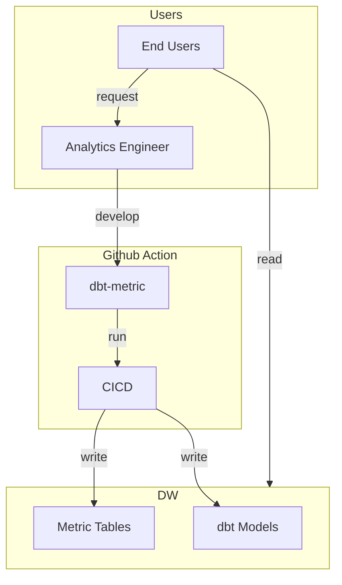
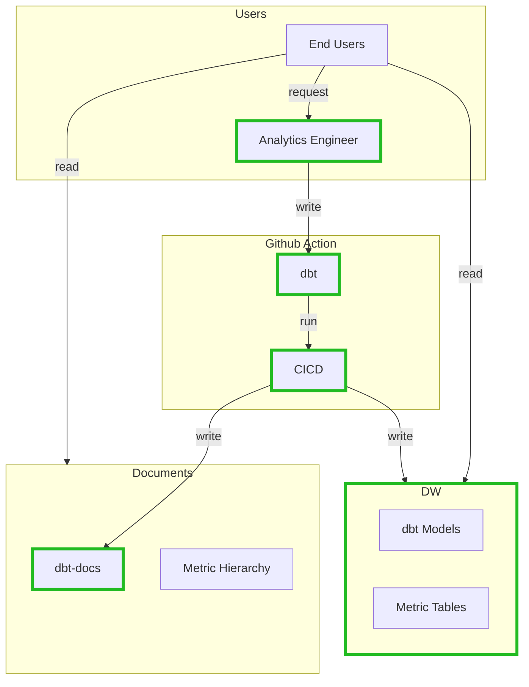
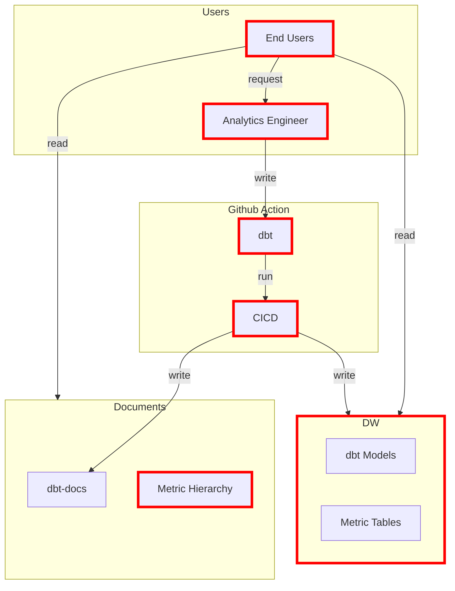

---
{"author":"jx2lee","aliases":"SAD - Current status","created":"2024-06-30T00:39:32.000+09:00","last-updated":"2023-11-03 13:56","tags":null,"dg-publish":true,"permalink":"/data/dbt/__/dbt-metricstore-sad-current-status/","dgPassFrontmatter":true,"noteIcon":""}
---


> [!tldr] 코인원 지표저장소의 현재 상태를 살펴본다.

### Overview


1. 요청자는 슬랙 혹은 지라 티켓을 통해 지표 생성을 요청한다.
2. 데이터셀에서 지표를 개발한다.
    1. [dbt-metric](https://github.coinfra.net/coinone/dbt-metric) repository 에서 작업한다.
    2. dbt 패키지인 dbt_utils 스펙에 맞게 Yaml 파일을 수정한다.
        - 상황에 따라 staging, prep 모델을 생성한다.
    3. dev/main 브랜치에 머지하며 지표가 정상적으로 생성되었는지 확인한다.
3. 지표를 요청자에게 전달한다. (lightdash 대시보드 등)


### Step-by-Step,





dbt 사용자(데이터셀)가 작업하는 상세 내용은 다음과 같다.

1. **{모델}.yaml metrics 추가**
    - `참조할 모델.yaml` 에 metrics 키를 추가하고, 어떠한 메트릭을 사용할지 property 를 정의한다.
      - [Available properties](https://docs.getdbt.com/docs/build/metrics#available-properties) 에서 설정값을 확인할 수 있다.
      - [Available calculation methods](https://docs.getdbt.com/docs/build/metrics#available-calculation-methods) 에서 제공하는 계산방식을 확인할 수 있다.
    - 한 가지 예시를 같이 살펴보면,
      ```
      metrics:
        - name: executed_trade_volume
          label: 체결 거래 대금
          model: ref("prep_trade")
          description: '{{ doc("executed_trade_volume") }}'
          calculation_method: sum
          expression: volume
          timestamp: created_at_kst
          time_grains:
            - day
            - month
          filters:
            - field: bid_orderer_channel
              operator: is not
              value: 'null'
            - field: ask_orderer_channel
              operator: is not
              value: 'null'
      ```
        - executed_trade_volume 이라는 메트릭 이름으로 prep_trade 모델을 참조한다.
        - 일/월별(time_grains) volume(expression) 합계(calculation_method)를 계산한다.
            - 단, bid_orderer_channel 와 ask_orderer_channel 이 null 이 아닌 볼륨만 필터링한다.

2. **metric_generator 스크립트 실행**
    - 스크립트를 실행하면, 설정한 metrics 키값을 기반으로 dbt_metrics 가 컴파일 할 수 있는 형태로 SQL 파일을 생성한다. 
        - 생성한 파일명은 다음 규칙에 따라 생성된다.
        - `metric_{time_grains}_{metrics.name}`
            - day → daily
            - week → weekly
            - month → monthly
                - [code link](https://github.coinfra.net/coinone/dbt-metric/blob/main/src/metric_generator.py#L13)
    - 생성한 SQL 파일은 models/metric/base 폴더에 쌓이고, `compile` 혹은 `run` 커맨드를 실행하면 dbt_metrics 패키지를 이용해 컴파일된다. 컴파일된 SQL 문을 로컬(`{root_dir{/target/compiled/`)에서 확인할 수 있다.
    - 작업 과정은 다음과 같다.
        - dbt-metric 저장소의 루트 디렉토리에서 아래 명령어를 실행한다.
        - `python src/metric_generator.py`
        - repo_root_dir/models/metric/base 폴더 내 선언한 지표 SQL 파일이 생성되었는지 확인한다.

3. **dbt cli 로 빌드 & 확인**
    - 사용자 profile 를 이용해 `dbt run` 커맨드로 지표 테이블을 생성한다.
        - ex. `dbt run –select metric_daily_metric_name`
        - 보통 지표 생성이 오면, prep 모델을 생성하고 이 모델을 이용해 지표를 추가한다. 혹은 기존에 있는 prep 모델에 지표를 추가한다. 따라서 아래 커맨드로 한 번에 빌드할 수 있다.
            - `dbt run --select prep_model_name+` 혹은 `dbt run --select +prep_model_name+`
            - more [Graph operators](https://docs.getdbt.com/reference/node-selection/graph-operators)

4. **PR 생성**
    - 작업자의 테스트가 완료되었다 판단되면 dbt-metric 레포에 PR 을 생성하고 리뷰를 진행한다.
    - 리뷰가 완료되면 main 브랜치에 머지되며, slim ci workflow 가 실행된다.
        - 위 wokrflow 는 변경된 모델만 빌드한다.
        - 참고
            - [Slim Continuous Integration: Retrieve the artifacts and do a state-based run](https://docs.getdbt.com/blog/slim-ci-cd-with-bitbucket-pipelines#slim-continuous-integration-retrieve-the-artifacts-and-do-a-state-based-run)
            - [How to use Slim CI with dbt Core](https://www.vantage-ai.com/blog/how-to-use-slim-ci-with-dbt-core)


### Pros and Cons




- Pros
    - 단일화된 지표 정의 및 구현 프로세스
        - 작업자에 의해 선택된 지표만 서비스로 제공된다. 따라서 결함이 있는 테이블 설계, 복잡한 비즈니스 로직, 정확하지 않은 용어 사용 등을 하나의 프로세스로 운영할 수 있어 오류를 낮추고 커뮤니케이션 코스트를 줄일 수 있다.
    - 낮은 의존성
        - 별도 어플리케이션을 구현하지 않고 CICD 운영을 통해 모든 지표와 문서를 생성한다.



- Cons
    - 지표 선택 제한
        - 결합 및 조합 가능한 모든 지표를 생성하지 않는다. 사용자가 직접 조합을 선택할 수 없고 작업자에 의해 선택, 구현, 배포되어야 지표로 생성될 수 있다. 따라서 제한된 정의만을 생성하게 된다.
    - 보유 지표 목록 조회 제한
        - 각 지표는 정의된 파라미터의 조합으로 이름이 지어져 나열되므로 파라미터의 수 만큼의 변종을 가지게 된다. 또한 모든 조합에 맞춰 지표가 생성되는 것이 아니고 작업자의 설정에 따라 지표를 생성하는 과정을 거쳐야 한다.
        - 따라서 사용자는 원하는 정의에 맞는 지표가 존재하는지 알기 어렵고 작업자 또한 충분한만큼의 조합을 거쳐 지표를 생성해두는 것이 불가능하다.
        - 지표의 계층을 정리(metric hierachy)하거나 메타 데이터들을 정리하는 작업(dbt-docs)을 통해 현황을 파악하려는 시도가 이어졌지만 일회성에 그치거나 사용자 친화적인 UX를 가지고 있지 않다.

> EOD
