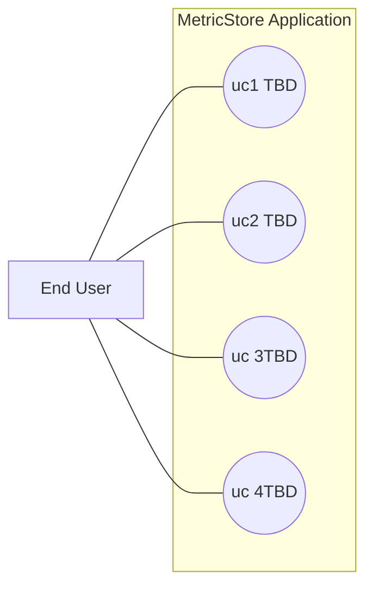

---
{"author":"jx2lee","aliases":"SDA - System Overview","created":"2024-06-30T00:39:32.000+09:00","last-updated":"2023-11-15 10:09","tags":null,"dg-publish":true,"permalink":"/data/dbt/__/dbt-metricstore-sad-system-overview/","dgPassFrontmatter":true,"noteIcon":""}
---

> [!tldr] 

### MetricStore Application

TBD

### Functionality

MetricStore Application 은 코인원 데이터를 활용해 지표를 탐색하고 생성할 수 있는 애플리케이션 이다. 다음 Use case 를 제공한다.
- Use case 1. TBD
- Use case 2. TBD
- Use case 3. TBD
- Use case 4. TBD

### Quality Attribute Requirements

Quality attribute scenarios 는 다음과 같다.

Modifiability
- TBD

Performance
- TBD

Reliability
- TBD

Availability
- TBD

