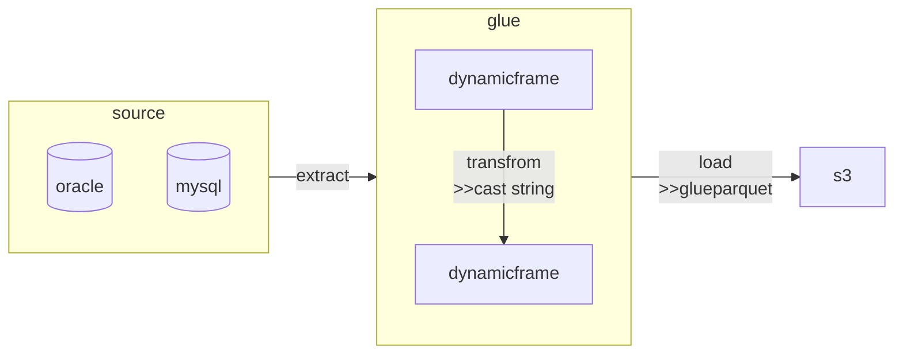

---
{"author":"jx2lee","aliases":"내가 착각하고 있었던 Glue DynamicFrame","created":"2025-08-19T22:33:03.292+09:00","last-updated":"2025-08-19 22:33","tags":["aws","glue","dynamicframe"],"dg-publish":true,"dg-home-link":true,"dg-show-local-graph":true,"dg-show-backlinks":true,"dg-show-toc":false,"dg-show-inline-title":true,"dg-show-file-tree":false,"dg-enable-search":true,"dg-link-preview":true,"dg-show-tags":false,"dg-pass-frontmatter":false,"permalink":"/data/etc/__/things-i-was-wrong-about-aws-glue/","dgHomeLink":true,"dgShowBacklinks":true,"dgShowLocalGraph":true,"dgShowInlineTitle":true,"dgEnableSearch":true,"dgLinkPreview":true,"dgPassFrontmatter":true,"noteIcon":""}
---

> [!info] 내가 잘못알고 있었던 Glue DynamicFrame 에 대한 내용을 정리하고 공유한다.

### background
AWS Glue와 DynamicFrame 개요
- AWS Glue는 서버리스 ETL 서비스로, Spark를 기반으로 한 분산 처리 엔진을 제공한다.
- Glue 의 데이터 추상화를 `DynamicFrame`, Spark DataFrame과 유사하지만 ETL 작업에 편리한 기능을 제공한다.

Spark DataFrame과의 관계
- DynamicFrame 은 Spark DataFrame 위에서 동작한다.
- 각 레코드를 DynamicRecord 로 표현한다. 따라서 스키마 불일치나 필드 누락, JSON 과 같은 스키마가 가변적인 반정형 데이터 처리에 유연하게 작동한다.

Pros
- 유연한 스키마 처리 (null-safe, 필드 누락 허용)
- ETL 에 편리한 메서드 지원 (ApplyMapping, ResolveChoice)
- JSON, Parquet, Avro 등 반정형/정형 데이터 처리 용이
- DataFrame ↔ DynamicFrame 변환

### 무얼 잘못알고 있었나
DynamicFrame 은 동적으로 태스크 메모리를 동적으로 늘릴 수 있다.
- 결론: **아니요. 착시현상입니다.**
- 런타임에 자동으로 늘릴 수 없다. Task(Partition)/Executor 힙 메모리는 런타임에 자동으로 커지지 않고 Executor 실행 시점의 설정값으로 고정한다. 자바 어플리케이션 실행 시 min|max heap memory 크기를 설정할텐데(이는 executor 프로세스), 낮은 컴퓨터 공학지식으로 접근했다. 
- DynamicFrame 가 아닌 AWS Glue 서비스의 특징 중 하나로, **executor 워커 오토스케일링(AutoScaling)** 과 **AEQ(Adaptive Query Execution) 파티션 전략**의 체감효과로 이해하는 것이 좋다.
    - [AEQ(Adaptive Query Execution)](https://spark.apache.org/docs/3.5.2/sql-performance-tuning.html#adaptive-query-execution): Spark SQL 의 최적화 기술(optimization technique) 로 런타임 통계값을 이용해 효율적인 쿼리 플랜(query execution plan) 을 선택할 수 있는 기술이라 정의한다. 3.2.0 이후부터 기본으로 활성화되고 옵션(`spark.sql.adaptive.enabled`) 으로 끄고 킬 수 있다. 주요 기능으로는 셔플 후 파티션 통합(coalescing post-shuffle partitions), 정렬 병합 조인을 브로드캐스트 조인으로 변환(sort-merge join to broadcast join), 스큐 조인(skew join) 최적화 등 세 가지 주요 기능이 있다. 자세한 내용은 공식문서를 참고하자.

(더 쓸거 없나ㅏㅏ)
- TBU

### 우리가 Glue 를 사용하는 패턴

- 서비스 데이터 조회 > 모든 컬럼 string 변환 > glueparquet 로 쓰기 작업에서만 사용한다.
- (주로, 가끔 변경하긴 하지만 자주는 아니다)스키마가 고정된 소스를 대상으로 수집한다.
- 변환하는 과정이 거의 없이 원본 그대로를 가져오는 영역에 사용한다.

사용패턴: **굉장히 단순하다.**
- 인덱스를 잘 태워 원본을 그대로 조회한 다음, string 으로 모든 컬럼을 캐스팅하고 parquet 포맷으로 s3 에 파케이 포맷으로 쓴다.
- 유연한 스키마 관리, ETL 에 편리한 메서드 제공, toDF 와 같은 Spark DataFrame 으로 변환할 수 있는 장점을 제대로 활용하고 있지 않다. 그래봤자 ApplyMapping 정도?