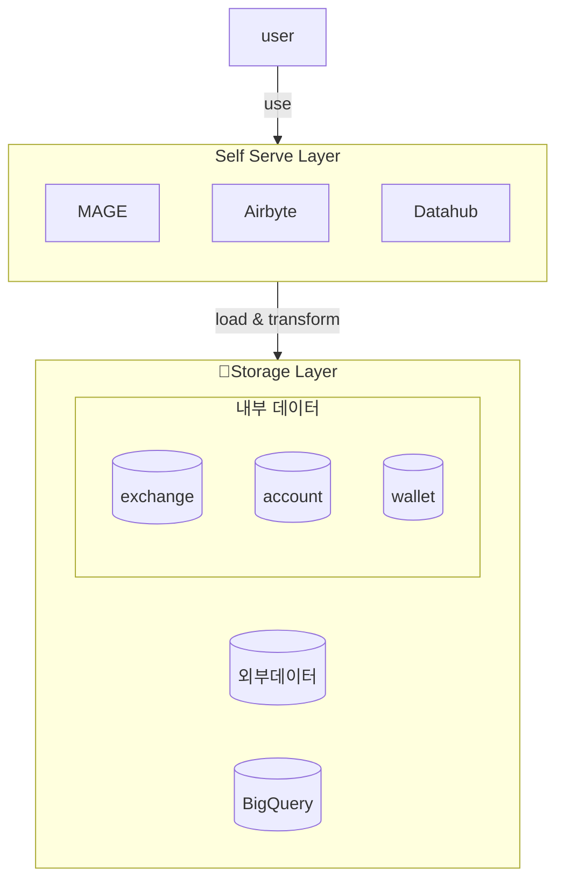

---
{"dg-publish":true,"permalink":"/data/etc/self-serve-data/","tags":["airbyte","datahub","opensource"],"dgLinkPreview":true,"noteIcon":"","created":"2024-07-28T02:04:17.031+09:00"}
---

### background
- 코인원 크루를 대상으로 데이터 조직 도움 없이 데이터를 활용할 수 있도록 하는 self data serve 환경이 필요했습니다. 기능조직인 데이터셀의 업무 부하를 줄이고 사용자들이 쉽게 데이터를 적재하고, 살펴보고, 혼자서도 뜯어볼 수 있는 환경을 만들고 싶었어요.
- 그래서 디스커버리 플랫폼인 Datahub, 외부 데이터 수집을 위한 Airbyte, 사용자 친화적인 고수준 환경을 제공하는 Mage.ai 를 사내 임직원들에게 제공하고자 합니다.

### objective
Self-data-serve 환경을 위한 데이터 도구들을 제공합니다.

### howto

- Datahub
    - 카탈로그 수집을 위해 Airflow 와 수집 스크립트를 이용합니다. RDB 는 information 스키마를, dbt 혹은 bigquery 는 datahub 에서 제공하는 ingestion CLI 를 활용한 컨테이너 이미지를 활용합니다.
        - RDB 의 information 스키마를 읽고 Datahub 포맷에 맞는 파일을 생성, 이를 주입하는 CLI 실행으로 동작합니다. 링크를 참고하여 [스크립트를](https://tech.socarcorp.kr/data/2022/03/16/metdata-platform-02.html) 작성했어요. (source -> [metadata file](https://datahubproject.io/docs/generated/ingestion/sources/metadata-file))
        - 작성된 스크립트는 Airflow 를 통해 일 배치로 수집합니다.
        - dbt, bigquery 의 메타데이터는 [링크](https://tech.socarcorp.kr/data/2022/03/16/metdata-platform-02.html)와 같은 recipe yaml & CLI 를 활용해 주입합니다. 
    - Helm 차트로 구성, ArgoCD 를 이용해 배포합니다.
- AirByte
    - 내부 데이터 수집은 Airflow Custom Operator 로, 외부 데이터(외부 거래소 데이터)는 Airbyte 로 수집했습니다. 데이터 성격(내부vs외부)에 따라 수집도구를 분류하고 싶었어요.
        - Airbyte 에서는 Python CDK 를 제공합니다. 특히, HTTP-API 기반 커넥터를 개발을 쉽게 할 수 있어요. 노코드 커넥터 빌더를 이용해 쉽게 구현할 수 있지만 비즈니스 로직이 더해진 커넥터가 필요할 때 적극 활용했어요.
        - custom connector 들을 담는 github repository 를 만들고 Action Workflow 를 이용해 컨테이너 이미지를 생성 & ECR 로 푸시하도록 구성했어요. 여러 커스텀 커넥터 이미지를 담고 있기 때문에 `metadata.yml` 의 시멘틱버저닝을 이용해 개발/운영 환경에 배포할 수 있도록 했어요.
    - Helm 차트로 구성, ArgoCD 를 이용해 배포했습니다. 
        - oss 버전에는 OAuth 기능을 [제공하지 않습니다](https://github.com/airbytehq/airbyte/issues/13021).
        - 클라우드에서만 제공하기에 oauth-proxy 를 이용해 google 계정으로 로그인 가능한 환경을 구성했어요. 보다 자세한 내용은 아래 more 에 첨부된 문서를 확인해주세요!
- MageAI
    - TBD

### result
- 사내 임직원을 위한 셀프 서브 환경을 제공했습니다.
    - DataHub: 사례로 보안 조직에서 개인정보 현황 파악을 위해 Datahub 를 이용했습니다. Tag 기능을 이용해 보안등급을 테이블 혹은 컬럼 단위로 부여하고, 보고자료(현황파악)에 활용했어요. Datahub 덕분에 DBA 조직에 따로 문의하지 않고 내부 데이터의 개인정보를 분류할 수 있었어요.
    - Airbyte: 사례로 국내 거래소 시간봉 api 를 이용해 보다 자세한 점유율을 사내에 제공했습니다. 물론 돈을 지불하고 쉽게 살펴볼 수 있는 서비스가 많았지만, 일 거래 금액을 보다 정확하게 측정하고 거래소 api 로 캔들 정보를 수집했어요. 이때 커스텀 커넥터를 개발하고 활용한 덕에 사내 크루들에게 신뢰할 수 있는 거래소 데이터를 제공했어요.
    - MageAI: TBD
- 본인이 원하는 데이터를 수집할 수 있도록 환경을 제공하고(Airbyte), 어떤 데이터가 어디 있는지 데이터 조직에 물어보지 않고 찾을 수 있으며(Datahub), 데이터 조직 도움없이 다양한 데이터를 활용할 수 있는 환경(MageAI)을 만들었어요.

### keytakeaway
- 많은 사용자가 선택한 성숙한 제품부터, 얼리 스테이징 단계에 있는 도구까지 여러 오픈소스를 경험했습니다.
    - Datahub 의 경우 문서를 굉장히 많이 참고했었는데, 처음으로 오픈소스에 기여해봤습니다. 대부분이 Docs 영역이긴 하지만 오픈소스 생태계에서 어떻게 소통하고 기여가 이루어지는지 체험할 수 있었어요.
    - 특히 MageAI 는 아직 사용자가 많지 않은 도구라 손이 많이 갔습니다. 배포 후 사용하는 조직에서도 이용에 많은 어려움이 있었지만 코드레벨로 깊게 파보기도 해봤고, 이슈를 발견하고 [리포팅 한 경험](https://github.com/mage-ai/mage-ai/issues/5197)도 있습니다.
    - 도구들이 어떻게 구성되어있는지(어떤 아키텍처인지), 도구들을 디깅하며 어떤 이유로 만들었는지 등 프로젝트 이전에 보지 못했던 넓은 시야를 갖게 되었습니다.
- 클라우드 환경에 오픈소스를 배포, 우리 환경에 맞게 때로는 변경했습니다.
    - 물론 배포한 도구들은 모두 헬름 차트를 제공했어요. Airbyte 의 경우 OAuth 기능을 클라우드에서만 제공 -> oauth2-proxy 등을 이용해 강력한 보안을 제공했어요.
    - 이러한 경험을 바탕으로 내부 데이터 프로덕트 개발 시 헬름 차트로 생성하여 배포하는 것을 목표로 하고 있어요.

### more
[[data/airbyte/__/airbyte-custom-chart\|Airbyte 차트 구성하기 (oauth2 & 커넥터 관리)]]
