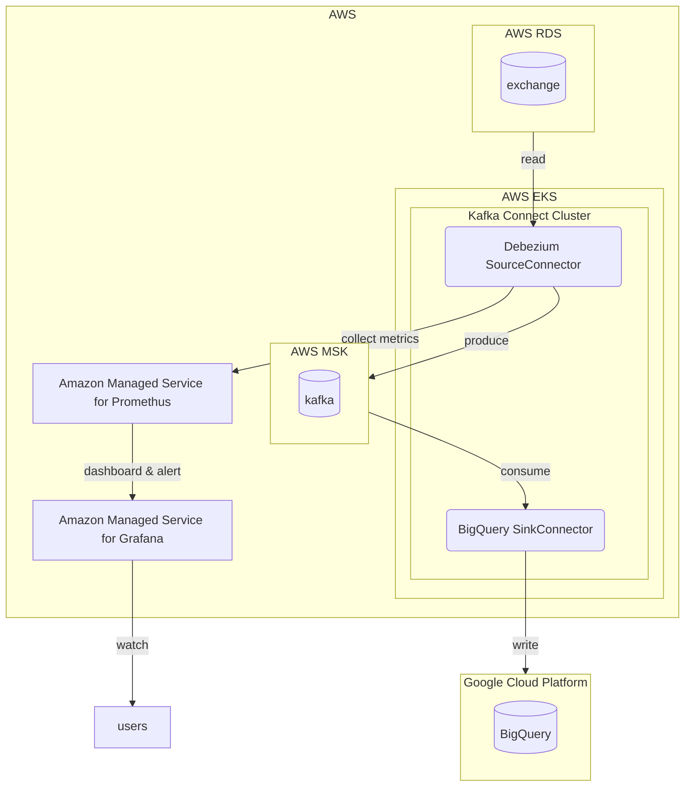

---
{"author":"jx2lee","aliases":["Debezium 을 이용한 CDC 파이프라인 구축"],"created":"2024-10-02T18:51:46.000+09:00","last-updated":"2024-06-16 15:44","tags":["debezium","kafka","mysql","connect","source"],"project":{"status":"done","include":true,"root":true,"company":"Coinone","duration":"2024.05 - 2024.08"},"dg-publish":true,"dg-home-link":false,"dg-show-local-graph":false,"dg-show-backlinks":false,"dg-show-toc":false,"dg-show-inline-title":false,"dg-show-file-tree":false,"dg-enable-search":false,"dg-link-preview":true,"dg-show-tags":false,"dg-pass-frontmatter":false,"permalink":"/data/kafka/__/cdc-pipeline-with-debezium/","dgLinkPreview":true,"dgPassFrontmatter":true,"noteIcon":""}
---

### background
- (당시) 코인원에서는 배치 파이프라인을 통해 DW, bigquery 로 내부 혹은 외부 데이터를 수집하고 있었습니다. 내부 RDB 데이터는 Airflow 커스텀 오퍼레이터를, 외부 데이터(coin market cap)는 Airbyte 를 사용하고 있어요.
- 서비스 개발 시 변경된 데이터가 필요하다는, 내부 니즈가 증가했습니다. 보통 서비스에 사용하는 테이블의 create/updated/delete 이벤트 이력을 남기는 log_ 테이블이 존재했지만 이를 반영하지 못하는 설계가 대부분이었어요. (당연히 고려하지 못했을거구요)
- 이에 debezium 을 이용해 CDC 데이터를 카프카에 발행하고 이를 소비하는 파이프라인을 구축했습니다.

### objective
- change data caputre 를 확인할 수 있는 환경을 제공합니다.
- 신뢰할 수 있는 change data capture 를 제공합니다.

### howto
**system architecture**

- 소스는 서비스에 사용하는 AWS RDS, 타겟은 DW 로 사용중인 BigQuery 입니다.
- 카프카 커넥트 클러스터는는 AWS EKS 에서 helm chart 형태로 ArgoCD 로 배포하였습니다. Debezium 소스커넥터와 BigQuery 싱크커넥터가 존재하며 Debezium 커넥터가 CDC 데이터를 수집할 테이블의 변경을 감지, MSK 로 메세지를 발행해요. 수집할 테이블 별 토픽이 생성되고 토픽 to BigQuery 테이블로 적재하는 과정은 BigQuery 싱크 커넥터가 담당해요. 실시간/배치 파이프라인에 의해 적재되는 데이터를 분리하고자 debezium 데이터셋 하위 테이블로 적재하도록 구성했어요.
- Debezium 커넥터는 jmx 메트릭을 제공합니다. 제대로 수집하고 있는지, 소스 빈로그를 잘 따라가고 있는지, 스냅샷은 잘 실행되었는지 확인하기 위해 모니터링 환경을 구성했어요. 커넥트 차트 promethus 템플릿을 활용하여 수집할 수 있는 메트릭들을 정의하고 이는 자동으로 AMP 로 수집하도록 구성했어요. 수집된 지표는 사내 사용중인 AMG 로 대시보드를 구성하였고 alert 을 설정했어요.

> 🤔 왜 Debezium 을 선택했나요
> Debezium 대안으로 다양한 도구들이 있지만, 다음과 같은 이유로 선정했습니다.
> - kafka friendly 해요. 그리고 카프카를 적극적으로 활용하고 있는 사내 환경을 고려했을 때 다양하게 활용될 수 있다고 판단했어요.
> - 많은 레퍼런스(defacto)를 가지며 국내/외 테크기업들에서 주로 사용하고 있었어요. (실제로 기업 테크블로그에서 많은 도움을 받았어요)
> 
> 🤔 왜 [MSK Connect](https://docs.aws.amazon.com/ko_kr/msk/latest/developerguide/msk-connect.html) 는 사용하지 않았나요?
> 고려하지 않은 건 아닙니다. Debezium 테스트할 당시 웹콘솔에서 간단히 설정할 수 있는 기능으로 쉽게 구성할 수 있었지만, (당시) 커넥터 옵션 변경 경험이 좋지 않았어요. Debeizum 커넥터의 경우 재실행하는 케이스도 많을텐데, 재실행 마다 커넥터를 삭제하고 생성해야 하는 불편함이 있었어요. 그리고, 기존에 사용하는 커넥트 클러스터가 있었고 이를 충분히 활용할 수 있다 판단 -> MSK Connect 는 이용하지 않기로 결정했어요.

### result
- CDC 파이프라인을 통해 기존에 변경된 데이터를 확인할 수 없는 테이블을 활용할 수 있었습니다. 이는 Transform 도구인 dbt 를 이용해 [labmda view](https://github.com/dbt-labs/dbt-labs-experimental-features/blob/main/lambda-views/README.md) 로 활용했어요.
- 사내 크루에게 조금 더 다양한 데이터를 확인할 수 있는 환경을 제공했습니다. 사실 CDC 데이터는 분석가/데이터 엔지니어를 제외한 크루에게는 쿼리하기 힘든 구조로 구성되어 있어요. 단순히 필요한 데이터만 내려주지 않고 ⬆️ 와 같은 사례로 활용할 수 있는 환경을 조성하도록 했어요.
- 모니터링을 통해 Debezium 이 동작못하는 상황을 캐치할 수 있는 임계값을 알 수 있었습니다. 

### troubleshoot
- 커뮤니케이션 with DBA
    - CDC 파이프라인을 구축하면서 DBA 와 많은 소통이 있었습니다. 서비스에 영향가지 않을 수준의 파이프라인을 구축해야했기 때문에 DB 부하를 최소화하고자 했어요. debezium 은 실행 시 snapshot 모드를 컨트롤할 수 있는 다양한 방법들이 존재해요. 또한, 스냅샷 모드를 실행할 때 단 한 번만 스냅샷을 진행하는 initial 모드가 있었고 DB 부하를 최소화 하기 위해 이 모드를 사용하도록 권유받았어요. 
    - 또한, 스냅샷 시 글로벌 read lock 방지를 위해 locking.mode 를 none 으로 설정했습니다. 이 옵션은 스냅샷 중에 커넥터가 테이블 잠금을 획득하지 못하도록 방지하는데, none 으로 설정하는 경우 스냅샷 진행 중 스키마가 변경되지 않도록 꼭 확인해주어야 해요.
    - 이러한 내용들을 DBA 에게 공유하고 추가로 궁금한 사항들에 대한 답변들을 주고 받으며 많이 찾아보고 공부했습니다. 트러블슈팅에 포함되지 않아도 될 내용이지만 서비스에 영향을 덜 주며 파이프라인 구성을 고려했다 는 점을 공유하고 싶었어요. `내 것만 하는 것이 아닌 주위도 살핀다` 라는 마인드로요.
- 커넥터 재실행 문제
    - 커넥터가 중지된 이후 DB 빈로그 리텐션 기간으로 커넥터가 읽어야할 빈로그가 사라진 경우 재시작하면 오류가 발생합니다. 이에 대한 여러 사례(도큐먼트 혹은 국내/외 블로그)들을 살펴봤고 소스 database 의 오프셋을 변경하는 [방법](https://debezium.io/documentation/faq/#how_to_change_the_offsets_of_the_source_database)을 확인했어요.
    - 커넥트 클러스터의 인터널 토픽으로 사용중인 offset 토픽에 중지된 커넥터 정보와 현재 읽기 가능한 빈로그 포지션을 메세지를 발송 -> 커넥터를 재실행 했습니다. 커넥터가 읽는 빈로그 정보를 갱신하는 방식으로 우회하였고, 단 이 방식은 읽지 못한 빈로그 기간 CDC 데이터를 누락할 수 있는 단점이 존재해요. 커넥터가 중지되는 걸 방지하기 위해 타이트한 모니터링을 진행하고 누락하지 않는 방법이 존재하는지 지금까지 살펴보고 있어요.

### keytakeaway
- Debezium 을 이용한 CDC 파이프라인을 구축했습니다.
- 변경된 데이터를 확인할 수 있는 환경을 구성하여 다양한 데이터를 제공했습니다.

### more
None
