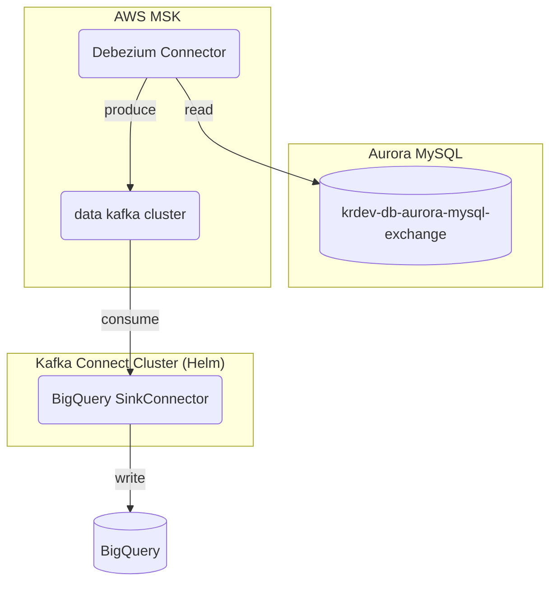

---
{"dg-publish":true,"permalink":"/data/kafka/__/debezium-mysql-connector/","tags":["debezium","kafka","mysql","connect","source"],"dgHomeLink":true,"dgShowBacklinks":true,"dgShowLocalGraph":true,"dgShowInlineTitle":true,"dgEnableSearch":true,"dgLinkPreview":true,"dgShowTags":true,"noteIcon":"","created":"2024-06-30T00:39:32.602+09:00"}
---


>[!SUMMARY]- Table of Contents
>  - [[data/kafka/__/debezium-mysql-connector#Environments\|Environments]]
>  - [[data/kafka/__/debezium-mysql-connector#Mysql Source Connector (debezium)\|Mysql Source Connector (debezium)]]
>  - [[data/kafka/__/debezium-mysql-connector#BigQuery Sink Connector\|BigQuery Sink Connector]]
>  - [[data/kafka/__/debezium-mysql-connector#result\|result]]

### Environments



- connect cluster: [AWS MSK Connectors](https://docs.aws.amazon.com/msk/latest/developerguide/msk-connect-connectors.html)
- source: [krdev-db-aurora-mysql-exchange-cluster](https://ap-northeast-2.console.aws.amazon.com/rds/home?region=ap-northeast-2#database:id=krdev-db-aurora-mysql-exchange-cluster;is-cluster=true)
	- schema.table: `rt_exchange.tb_currency_info`
- target: BigQuery
	- project.dataset.table: `coinone-data-dev.debezium.tb_currency_info`
- connectors
	- source
		- [debezium connector for MySQL](https://debezium.io/documentation/reference/stable/connectors/mysql.html)
		- version: 2.6.1
	- sink
		- [BigQuery Sink Connector](https://docs.confluent.io/kafka-connectors/bigquery/current/overview.html)
		- version: custom ([github](https://github.coinfra.net/coinone/coinone-data-kafka-connect-bigquery))


### Mysql Source Connector (debezium)
- 소스 커넥터는 연준님이 작성하신 문서를 기반으로 생성하였습니다. (AWS MSK Connectors 이용, rt_exchange.tb_currency_info)
- 커넥터 옵션에 아래 두 개를 추가하였습니다. 추가한 이유는 다음과 같습니다.
	```
	value.converter=org.apache.kafka.connect.json.JsonConverter
	value.converter.schemas.enable=true
	```
	- 카프카 메세지는 키/밸류 형태의 바이트 입니다. 다양한 직렬화 포맷을 지원 합니다. (JSON, Avro, Protobuf, String delimited)
	- 위 옵션을 커넥터에 적용하면, 키/밸류 스키마의 정보를 JSON 형태로 저장합니다. schema/payload 로 구분하며 각각 스키마 정보/커넥터 읽은 페이로드를 의미합니다. 한 가지 예시를 들면 다음과 같습니다.
		```
		{
		  "schema": {
		    "type": "struct",
		    "fields": [
		      {
		        "type": "struct",
		        "fields": [
		          {
		            "type": "int32",
		            "optional": false,
		            "field": "code"
		          },
		          {
		            "type": "string",
		            "optional": false,
		            "field": "symbol"
		          },
		          {
		            "type": "int64",
		            "optional": false,
		            "field": "scale_factor"
		          }
		        ],
		        "optional": true,
		        "name": "debezium_test.coinone_raptor.tb_currency_info.Value",
		        "field": "before"
		      },
		      {
		        "type": "struct",
		        "fields": [
		          {
		            "type": "int32",
		            "optional": false,
		            "field": "code"
		          },
		          {
		            "type": "string",
		            "optional": false,
		            "field": "symbol"
		          },
		          {
		            "type": "int64",
		            "optional": false,
		            "field": "scale_factor"
		          }
		        ],
		        "optional": true,
		        "name": "debezium_test.coinone_raptor.tb_currency_info.Value",
		        "field": "after"
		      },
		      {
		        "type": "struct",
		        "fields": [
		          {
		            "type": "string",
		            "optional": false,
		            "field": "version"
		          },
		          {
		            "type": "string",
		            "optional": false,
		            "field": "connector"
		          },
		          {
		            "type": "string",
		            "optional": false,
		            "field": "name"
		          },
		          {
		            "type": "int64",
		            "optional": false,
		            "field": "ts_ms"
		          },
		          {
		            "type": "string",
		            "optional": true,
		            "name": "io.debezium.data.Enum",
		            "version": 1,
		            "parameters": {
		              "allowed": "true,last,false,incremental"
		            },
		            "default": "false",
		            "field": "snapshot"
		          },
		          {
		            "type": "string",
		            "optional": false,
		            "field": "db"
		          },
		          {
		            "type": "string",
		            "optional": true,
		            "field": "sequence"
		          },
		          {
		            "type": "int64",
		            "optional": false,
		            "field": "ts_us"
		          },
		          {
		            "type": "int64",
		            "optional": false,
		            "field": "ts_ns"
		          },
		          {
		            "type": "string",
		            "optional": true,
		            "field": "table"
		          },
		          {
		            "type": "int64",
		            "optional": false,
		            "field": "server_id"
		          },
		          {
		            "type": "string",
		            "optional": true,
		            "field": "gtid"
		          },
		          {
		            "type": "string",
		            "optional": false,
		            "field": "file"
		          },
		          {
		            "type": "int64",
		            "optional": false,
		            "field": "pos"
		          },
		          {
		            "type": "int32",
		            "optional": false,
		            "field": "row"
		          },
		          {
		            "type": "int64",
		            "optional": true,
		            "field": "thread"
		          },
		          {
		            "type": "string",
		            "optional": true,
		            "field": "query"
		          }
		        ],
		        "optional": false,
		        "name": "io.debezium.connector.mysql.Source",
		        "field": "source"
		      },
		      {
		        "type": "string",
		        "optional": false,
		        "field": "op"
		      },
		      {
		        "type": "int64",
		        "optional": true,
		        "field": "ts_ms"
		      },
		      {
		        "type": "int64",
		        "optional": true,
		        "field": "ts_us"
		      },
		      {
		        "type": "int64",
		        "optional": true,
		        "field": "ts_ns"
		      },
		      {
		        "type": "struct",
		        "fields": [
		          {
		            "type": "string",
		            "optional": false,
		            "field": "id"
		          },
		          {
		            "type": "int64",
		            "optional": false,
		            "field": "total_order"
		          },
		          {
		            "type": "int64",
		            "optional": false,
		            "field": "data_collection_order"
		          }
		        ],
		        "optional": true,
		        "name": "event.block",
		        "version": 1,
		        "field": "transaction"
		      }
		    ],
		    "optional": false,
		    "name": "debezium_test.coinone_raptor.tb_currency_info.Envelope",
		    "version": 2
		  },
		  "payload": {
		    "before": null,
		    "after": {
		      "code": 100301,
		      "symbol": "ostest01",
		      "scale_factor": 10000
		    },
		    "source": {
		      "version": "2.6.1.Final",
		      "connector": "mysql",
		      "name": "debezium_test",
		      "ts_ms": 1715836639000,
		      "snapshot": "true",
		      "db": "coinone_raptor",
		      "sequence": null,
		      "ts_us": 1715836639000000,
		      "ts_ns": 1715836639000000000,
		      "table": "tb_currency_info",
		      "server_id": 0,
		      "gtid": null,
		      "file": "mysql-bin-changelog.003519",
		      "pos": 74659447,
		      "row": 0,
		      "thread": null,
		      "query": null
		    },
		    "op": "r",
		    "ts_ms": 1715836639988,
		    "ts_us": 1715836639988489,
		    "ts_ns": 1715836639988489000,
		    "transaction": null
		  }
		}
		```
		- value.converter 를 StringConverter 로 지정하면(연준님이 테스트한 옵션) 메세지의 키/밸류에 스키마 정보를 포함하지 않습니다.
		- 그럼 왜 포함하도록 지정했나요?
			- BigQuery SinkConnector 의 경우 키/밸류의 스키마 값이 없으면 [강제로 익센셥](https://github.com/confluentinc/kafka-connect-bigquery/blob/c3b0b0cc2acabdd63b364de5d5b16085a7d36afe/kcbq-connector/src/main/java/com/wepay/kafka/connect/bigquery/convert/BigQueryRecordConverter.java#L89)을 뱉어냅니다. 해당 메소드 주석을 살펴보면, `각 필드가 이름/값으로 구성되어야 하는 행 형식으로 변환하려면, {@link Struct} 유형이어야 합니다.` 라고 합니다. 
		- 기존 방식으로 저장된 메세지를 싱크할 순 없나요?
			- 네.. 저장된 메세지 형태가 `{"schema": blahblah, "payload": blahblah}` 아니라면 빅쿼리 싱크 커넥터 수정이 필요해요.
			- 수정한다 하더라도 수집 레코드의 스키마가 없는 상황이라.. 제대로 컨버팅 해서 빅쿼리로 적재할 수 있을지는 더 살펴봐야 알겠지만 현재 상태로는 확인하지 못했어요!
				- 시간을 더 투자하여 디버깅 한다면 알 순 있겠지만 유의미하지 않을 것 같아요.
				- 이정도로 마무리하고, 추후 시간이 남으면 찾는걸로..
- connect 관련 자료는 [컨플루언트](https://www.confluent.io/blog/kafka-connect-deep-dive-converters-serialization-explained/)에 잘 정리된 것 같아요. 이 문서 참고하시면서 보면 좋을 것 같아 남깁니다!


### BigQuery Sink Connector
- 기존 회원/거래 수집 파이프라인과 동일한 환경에 생성(data-helm) 하였습니다.
- 이번 테스트 작업에서와 다른 점으로는 transform 을 사용하지 않았고, 빅쿼리 테이블을 미리 생성하지 않고 싱크 커넥터에서 자동으로 생성할 수 있도록 구성하였습니다. 회원/거래 파이프라인의 경우 header 값들을 필드로 가져오기 위해 여러 [transform](https://coinone-jira.atlassian.net/wiki/spaces/DA/pages/470550213#connector) 을 사용하였는대요, 이번 작업에서는 사용할 필요가 없어 제외하였습니다. 그리고 소스 커넥터에서 이미 스키마를 감지하기 때문에 미리 빅쿼리 테이블을 생성할 필요가 없어 자동으로 생성하도록 구성하였습니다.
	- transform 을 사용하지 않았습니다.
	- 커넥터 생성 시 빅쿼리에 자동으로 테이블을 생성합니다.
- 추가된 옵션은 다음과 같습니다.
	- `autoCreateTables=true`: 자동으로 테이블 생성하도록 하는 옵션입니다. 활성화 시 빅쿼리 테이블 스키마를 미리 지정하지 않고 자동으로 매핑 합니다.
	- `allBQFieldsNullable=true`: 모든 필드에 널값을 허용하는 옵션입니다. false 인 경우 운영 난이도가 높아질 것으로 예상, 되도록이면 활성화 하는 것이 좋을 것 같습니다.


### result
- Connectors
	- Source: [debezium-connector-test](https://ap-northeast-2.console.aws.amazon.com/msk/home?region=ap-northeast-2#/connector/arn%3Aaws%3Akafkaconnect%3Aap-northeast-2%3A883976656071%3Aconnector%2Fdebezium-connector-test%2Fe6ddab9d-60e2-44fa-b04c-ee4290caf9f9-3/view)
	- Sink: [DebeziumTestConnector2](https://krdev-kafka-connect-ui.coinone.me/#/cluster/coinone-data-warehouse-sink-connector/connector/DebeziumTestConnector2)
- topic: `debezium_test.rt_exchange.tb_currency_info`
- [target](https://console.cloud.google.com/bigquery?project=coinone-data&ws=!1m5!1m4!4m3!1scoinone-data-dev!2sdebezium!3stb_currency_info)


