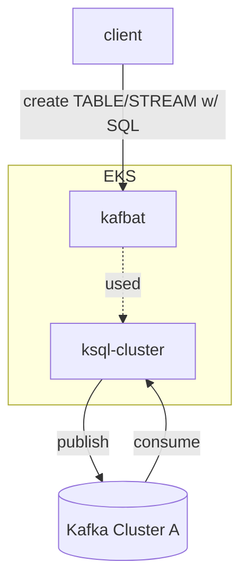

---
{"author":"jx2lee","aliases":"KSQL 로 분 단위 집계 구현해보기","created":"2025-01-03T23:37:40.000+09:00","last-updated":"2024-12-21 15:02","tags":["kafka","ksql"],"dg-publish":true,"dg-home-link":true,"dg-show-local-graph":false,"dg-show-backlinks":true,"dg-show-toc":false,"dg-show-inline-title":false,"dg-show-file-tree":false,"dg-enable-search":true,"dg-link-preview":true,"dg-show-tags":false,"dg-pass-frontmatter":false,"permalink":"/data/kafka/__/ksql-demo/","dgHomeLink":true,"dgShowBacklinks":true,"dgEnableSearch":true,"dgLinkPreview":true,"dgPassFrontmatter":true,"noteIcon":""}
---




### 재료
- environment: `dev`
- topic: `debezium.{for_trade_table}`


### 집계 Table 생성에 필요한 Stream 생성하기

ksql 에서는 table/stream 개념이 존재하는데, bounded(state)/unbounded 으로 이해하면 좋다. 컨플루언트 문서를 살펴보면 좋을 것 같아 [링크](https://developer.confluent.io/courses/ksqldb/streams-and-tables/?utm_medium=sem&utm_source=google&utm_campaign=ch.sem_br.nonbrand_tp.prs_tgt.dsa_mt.dsa_rgn.apac_lng.eng_dv.all_con.confluent-developer&utm_term=&creative=&device=c&placement=&gad_source=1&gclid=CjwKCAiAyJS7BhBiEiwAyS9uNfCFBoUwDYJcwKHVLAHGTIIcvK9KthDsho_jRV-tS8en46WLzrzW0hoC2JIQAvD_BwE)로 남긴다. 데비지움 메세지 포맷을 파싱한 trade_raw Stream 을 kafbat 에서 생성해보자.

```sql
CREATE STREAM trade_raw (
  schema STRUCT<
    type STRING,
    fields ARRAY<STRUCT<
      type STRING,
      optional BOOLEAN,
      field STRING,
      name STRING,
      version INTEGER,
      default STRING,
      parameters STRUCT<
        allowed STRING
      >
    >>,
    optional BOOLEAN,
    name STRING,
    version INTEGER
  >,
  payload STRUCT<
    before STRUCT<
      id BIGINT,
      ...
    >,
    after STRUCT<
      id BIGINT,
      ...
    >,
    source STRUCT<
      version STRING,
      `connector` STRING,
      name STRING,
      ts_ms BIGINT,
      snapshot STRING,
      db STRING,
      sequence STRING,
      `table` STRING,
      server_id BIGINT,
      gtid STRING,
      file STRING,
      pos BIGINT,
      row INTEGER,
      thread BIGINT,
      `query` STRING
    >,
    op STRING,
    ts_ms BIGINT,
    transaction STRUCT<
      id STRING,
      total_order BIGINT,
      data_collection_order BIGINT
    >
  >
) WITH (
  KAFKA_TOPIC='{your_source_topic}',
  VALUE_FORMAT='JSON'
);
```


- WITH 구문으로 바라볼 소스 토픽을 선택하고,
- VALUE 포맷을 지정한다. 현재 JSON 을 사용하고 있지만 추후 Avro or ProtoBuf 직렬화 포맷을 사용할 수 있으니(w/ Kafka Registry) 참고하자.

이렇게 소스토픽을 바라보는 스트림 혹은 테이블을 생성하면 `바로 토픽이 생성되겠지?` 생각했지만 아직 생성되지 않았다. (끝 부분에 확인할 수 있는데 소스와 직접 연결된 리소스를 이용하면 그때 모두 생성한다.)


검색되지 않는 Stream

### trade_raw 전처리한 Stream 생성하기

struct 로 뭉쳐있는 각 값들을 destrcut 하고 timestamp 형변환된 스트림을 생성해보자.

```sql
CREATE STREAM trade_history WITH (
  TIMESTAMP='timestamp',
  TIMESTAMP_FORMAT='yyyy-MM-dd''T''HH:mm:ss''Z'''
) AS
SELECT
  payload->after->id AS id,
  ...
  payload->after->timestamp AS timestamp
FROM trade_raw
EMIT CHANGES;
```

`->` 와 같은 문법을 사용한다. 독특하다. ksqldb 탭에 가면 스트림이 생성된 것을 확인할 수 있다.

### 리파티셔닝한 Stream 생성하기

Windowing 기능은 GROUP BY 와 함께 사용해야 한다. GROUP BY 는 메세지 키로 집계한다. 현재 생성된 스트림에는 키가 없기 때문에, 더미 키를 가지도록 스트림을 생성한다.
```sql
CREATE STREAM trade_repartitioned AS
SELECT *
FROM trade_history
PARTITION BY 'ALL';
```

리파티셔닝한 스트림 생성 시 이전에 정의한 Stream 들이 토픽으로 생성된 것을 확인할 수 있다.


### 집계 Table 생성하기

window 기능과 함께 분 단위 집계결과를 Table 로 생성한다.
```sql
CREATE TABLE trades_per_minute AS
SELECT
  'ALL' AS group_key,
  TIMESTAMPTOSTRING(WINDOWSTART, 'yyyy-MM-dd HH:mm:ss') AS window_start,
  COUNT(*) AS trade_count
FROM trade_repartitioned
WINDOW TUMBLING (SIZE 1 MINUTE, GRACE PERIOD 10 SECONDS)
GROUP BY 'ALL'
EMIT FINAL;
```

> [!question] EMIT FINAL & GRADE PERIOD
> EMIT CHANGES 와 EMIT FINAL 이 존재한다. EMIT FINAL 인 경우
> 윈도우가 닫힐 때만 최종 결과를 발행한다. EMIT CHANGES 는 윈도우가 닫히든 말든 모든 변경사항을 확인하는 경우 사용하기 때문에 이 예제에서는 FINAL 을 선택했다.
> https://docs.confluent.io/platform/current/ksqldb/developer-guide/ksqldb-reference/select-push-query.html#emit 
> 
> 윈도우는 다음 메세지가 도착할 때 닫히므로 윈도우 끝 이후 메세지가 늦게 도착할 수 있음을 감안하여 GRADE PERIOD 옵션을 사용했다.
> https://docs.confluent.io/platform/current/ksqldb/developer-guide/ksqldb-reference/quick-reference.html#grace-period


### 운영 시 고려해야할 혹은 더 봐야할 것들

- Stream/Table 로 생성된 토픽들 관리는? retention.bytes, segment.bytes 등 리텐션 관련 옵션들이 default 따라가는지, 쿼리 내 옵션을 부여할 수 있는지 확인이 필요하다.
- 배포 전략은? ksqlDB 는 interactive ksqlDB / headless 배포 옵션을 제공한다. 어느게 우리 환경에 맞을지는 조금 더 살펴봐야한다. [Deep Dive into ksqlDB Deployment Options | Confluent](https://www.confluent.io/blog/deep-dive-ksql-deployment-options/)
- ksqldb 도 지금 헬름 차트로 배포했다. 카프카 클러스터가 늘어난다면 그만큼 차트도 늘어날테니(결국 중복) 쿠베환경에서 편리하게 운영할 수 있는 다른 무언가가 있는지(혹은 만들던지) 찾아보면 좋을 것 같다.


### (추가) 카프카 클러스터 옵션 변경
- 배경: ksql 차트 배포 후 kafbat UI 에서 stream/table 이 생성되지 않은 문제를 발견함. 로그에는 Timeout 오류가 발생했고, 실험한 클러스터에 토픽 옵션 / 클러스터 옵션을 비교했다.
    - 토픽 옵션은 영향을 주지 않았다.
    - `transaction.` 옵션이 다른 것을 확인 -> ksql 내부에 `transaction.*` 옵션이 영향을 주는지 파악해봄
        - 카프카에서도 트랜잭션 개념이 존재하는데 트랜잭션을 보장하는 메세지를 발행/소비 할 수 있다. 이는 Transaction Coordinator 라는 녀석이 관리하며 이런 메세지를 Transaction Log (카프카 공식문서에는 트랜잭션 토픽이라 설명한다) 에 저장한다.
        - ksql 에서는 table/stream 생성을 위해 인터널 토픽을 사용하고, 이는 트랜잭션을 보장하는 Transaction log 임을 [확인](https://www.confluent.io/blog/ksqldb-ensures-consistent-internal-state-reliability-recovery-using-kafka-transactions/#:~:text=We%20realized%20that%20we%20could%20coordinate%20between%20ksqlDB%20servers%20by%20integrating%20Kafka%E2%80%99s%20transaction%20mechanism%20into%20the%20protocol%20that%20validates%20and%20produces%20statements%20to%20the%20command%20topic.)했다.
    - 위 내용으로 현재 클러스터 옵션을 살펴보니, `transaction.state.log.replication.factor` 값이 3임을 확인했는데 어라? 브로커가 2대네? -> 트랜잭션 토픽(그 중에서도 트랜잭션을 보장하는) 생성에 실패한 것을 알 수 있었다. ([옵션 링크](https://kafka.apache.org/documentation/#brokerconfigs_transaction.state.log.replication.factor))
- 원인: `transaction.state.log.replication.factor` 값은 3, 브로커 2대이다 보니 트랜잭션 로그 생성에 실패
- 해결: MSK 옵션 수정 (브로커 롤링 업데이트 진행)


### References
- https://docs.confluent.io/platform/current/ksqldb/overview.html
- https://hub.docker.com/r/confluentinc/cp-ksqldb-server
- https://github.com/confluentinc/cp-helm-charts/tree/master?tab=readme-ov-file
- Transaction in Kafka
    - https://www.confluent.io/blog/transactions-apache-kafka
    - https://www.confluent.io/blog/exactly-once-semantics-are-possible-heres-how-apache-kafka-does-it
