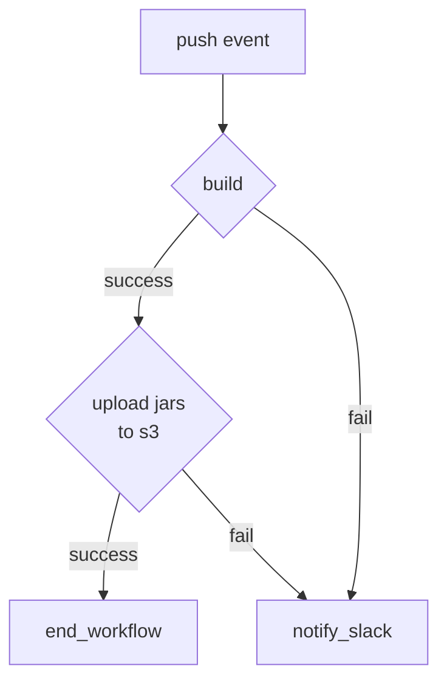

---
{"dg-publish":true,"permalink":"/data/kafka/__/migration-connector-cicd/","tags":["kafka","connect","github","cicd"],"noteIcon":"","created":"2024-06-30T00:39:32.603+09:00"}
---

> [!info] ACCOUNT EDA 메세지 적재를 위한 커넥터 & transform 빌드/배포를 정리한다.

### 커넥터 & 트랜스폼 빌드배포 과정

빌드와 배포는 하나의 워크플로우에서 진행된다. (jobs: build, upload)

빌드
- dev/main 브랜치 푸시 이벤트가 발생하면 빌드를 실행한다.
- 단, 푸시 src/ 하위 폴더 내 파일이 변경된 경우에만 워크플로우를 실행한다.
- 빌드에 실패한 경우, 슬랙으로 알람을 발송한다.

배포
- 배포는 빌드된 결과물을 s3 로 업로드 하는 과정이다.
- s3 로 업로드한 이유는 다음과 같다.
  - [Worker Configuration properties file](https://docs.confluent.io/platform/current/connect/userguide.html#connect-configuring-workers) 과 같이 카프카 커넥트 워커의 설정파일이 존재한다.
    - 위 설정파일은 kafka-connect-ui 에서 설정할 수 있다.
  - 설정파일에 plugin.path 프로퍼티를 이용해 커스텀 트랜스폼을 사용할 수 있는 경로를 지정할 수 있다.
    - 업로드된 jar 파일들은 커넥터 클러스터의 plugin.path 로 설정되어 있다. 커넥터 설정값에 패키지를 명시하여 사용가능하다.
  - 빌드한 jar 파일들을 수동으로 올리는 것보다, 빌드를 성공하면 자동으로 업로드(s3 bucket)하고 커스텀 패키지를 사용할 수 있도록 구현했다.
  - 인프라셀에서 s3 버킷을 싱크하는 사이드카 컨테이너를 구현해주셨다.
  - [작업 티켓]()
- 배포에 실패한 경우, 슬랙으로 알람을 발송한다.

### reference
- [[data/kafka/__/migration-used-packages\|[migrate-to-kafka-connect]사용중인 커넥터 & 트랜스폼트랜스폼]]]
- [Worker Configuration properties file](https://docs.confluent.io/platform/current/connect/userguide.html#worker-configuration-properties-file)
