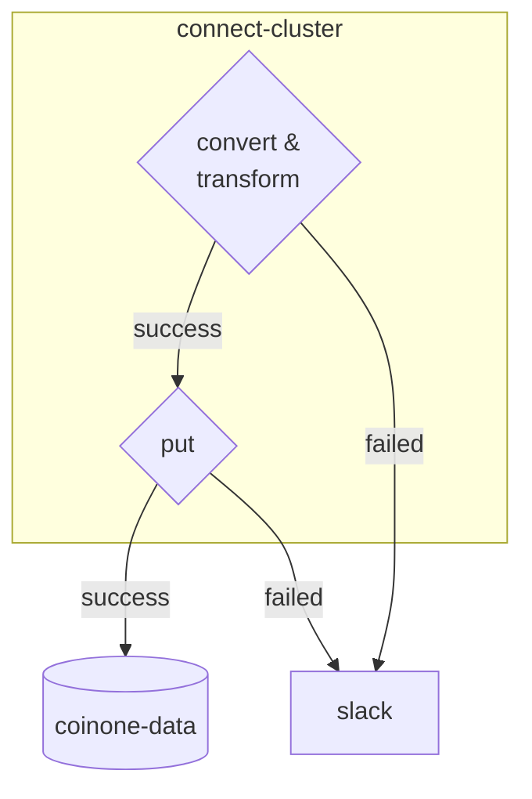

---
{"dg-publish":true,"permalink":"/data/kafka/__/migration-error-handling/","tags":["kafka","connect"],"dgHomeLink":true,"dgShowBacklinks":true,"dgShowLocalGraph":true,"dgEnableSearch":true,"dgLinkPreview":true,"noteIcon":"","created":"2024-06-30T00:39:32.000+09:00"}
---


> [!tldr]
> kafka-connect-biguqery 커넥터로 회원 이벤트 메세지를 빅쿼리로 적재한다. 중복된 메세지는 Transform 영역에서 해결하고, connect 처리에 실패한 메세지는 DLT 로 발행하지 않는다.


### 배경


- DW 로 적재하는 테스트를 완료했다. (로컬)
- 배포 전 싱크에 실패한 메세지를 처리하는 방안이 필요하다.
- ACCOUNT-PART EDA 에서는 다음과 같은 로직을 갖는다.
    1. 컨슈머가 일정 횟수동안 처리를 시도한다.
    2. 일정 횟수만큼 처리되지 않으면 DLT 토픽으로 실패한 메세지를 발행한다. (`발행대상 토픽: {topic}.DLT`)
    3. 어드민 서버에서 DLT 토픽에 쌓인 메세지를 기존 토픽으로 재발행한다.


### Kafka connect 에서의 에러 처리 방법


confluent 공식 문서에 나와 있는 내용을 바탕으로 정리한다.

#### 1. Fail fast


```
errors.tolerance = none
```


- 처리에 실패하면 커넥터 인스턴스를 종료한다.
    - 잘못된 메세지(bad message)를 단순히 건너뛰지 않는다.
    - 종료된 커넥터를 재실행하기 위해서는, connect ui 혹은 재시작 API 를 이용해야한다.

> [!info] 커넥터 인스턴스 (connector instance)
> - 커넥터 인스턴스는 Kafka와 다른 시스템 간 데이터 복사를 관리하는 논리적 작업(logical job) 이라고 한다.
> - `A connector instance is a logical job that is responsible for managing the copying of data between Kafka and another system`


#### 2. Silently ignore bad messages


```
errors.tolerance = all
```


- 처리에 실패한 레코드가 있다면 무시한다.
- 커넥터의 상태를 확인해보면 RUNNING 을 유지하고 있다.
    ```
    $ curl -s "http://localhost:8083/connectors/file_sink_05/status"| jq -c -M '[.name,.tasks[].state]'
    ["file_sink_05","RUNNING"]
    ```
- 오류가 발생하고 있다는 것은 알 수 있지만 어떤 메시지에서 어떤 오류가 발생했는지는 알 수 없습니다. (의도한 거라면 문제 없다)
- 처리에 실패한 메세지를 재처리 하기 좋은 옵션은 아니다.


#### 3. Route messages to a dead letter queue


```
errors.tolerance = all
errors.deadletterqueue.topic.name = 
```


- 처리할 수 없는 메시지는 별도 Kafka 토픽인 Dead Letter Topic(이하 DLT) 으로 보내도록 구성할 수 있다.
- 유효한 메시지는 정상적으로 처리되며 파이프라인은 계속 실행된다. 유효하지 않은 메시지는 DLT 에서 검사하여 필요에 따라 무시하거나 수정하여 재처리할 수 있다.
- 유효하지 않으 메세지를 처리하고난 이후 status 는 `RUNNING` 임을 확인할 수 있다.
- DLT 로 적재할 때 실패한 원인을 header 에 담거나, 로그에 남겨 확인할 수 있는 방법이 있다.
    1. 헤더에 담는 경우
        - properties
            ```
            errors.tolerance = all
            errors.deadletterqueue.topic.name = 
            errors.deadletterqueue.context.headers.enable = true
            ```
    2. 로그에 담는 경우
        - properties
            ```
            errors.tolerance = all
            errors.deadletterqueue.topic.name = 
            errors.log.enable = true
            ```


#### conclusion


### 방안


#### limits


- 커넥터 클러스터는 백엔드셀 카프카를 구독한다.
- DLT 로 메세지 발행 시 커넥트에서 보장하는 영역은 Convert, Transform 이다.
    - `errors.tolerance`: 커넥터의 convert/transform 과정에서 실패한 메세지만 처리할 수 있다. 
    - **초기화 및 poll/put 영역은 보장하지 않는다.**
        - Connector lifecycle: initialize → poll(source) → convert → trasnform → put(sink) →  stop
- 커넥터는 `At least once delivery` 를 보장한다. (**적어도 한 번**)
    - 어떠한 경우에서라도 메세지를 적어도 한 번 보장하기 때문에, **bigquery 에 중복저장될 수 있다.**


#### diagram





- convert & trasnform 을 실패한 메세지는 그라파나 alter 기능을 이용해 슬랙에 전송한다.
    - DLT 토픽을 사용하지 않는 이유는 다음과 같다.
        - convert 에서 오류가 발생할 수 없다. 회원 이벤트 메세지의 스키마가 없기 때문이다.
        - 메세지 포맷이 변경되지 않는다면 transform 에서 오류가 발생할 수 없다.
    - 처리에 실패한 메세지는 ERROR 로그로 남기도록 설정한다.
    - ERROR 로그가 발생하면 그라파나 alerting 기능을 이용해 알람을 전송한다.
- 알람 발생과 동시에 실패한 메세지를 빅쿼리로 재적재한다.
    - 에러로그에는 처리에 실패한 메세지 원본을 남긴다.
    - 알람 발생은 kibana alerting 기능을 이용한다.
    - `2339_데이터_모니터링` 채널로 발송한다.


### reference


- https://www.confluent.io/blog/kafka-connect-deep-dive-error-handling-dead-letter-queues
- https://docs.confluent.io/platform/current/connect/index.html
- https://developer.confluent.io/courses/kafka-connect/intro
- https://kafka.apache.org/documentation/#connectconfigs
- https://www.confluent.io/blog/kafka-connect-tutorial
- connector lifecycle
    - [kafka Connector Architecture](http://www.igfasouza.com/blog/kafka-connector-architecture)
- etc
    - https://blog.voidmainvoid.net/504
    - https://blog.voidmainvoid.net/507
    - https://tech.kakao.com/2023/01/12/introduce-kafka-sink-connector
    - https://huisam.tistory.com/entry/kafka-message-semantics
    - https://brunch.co.kr/@peter5236/3