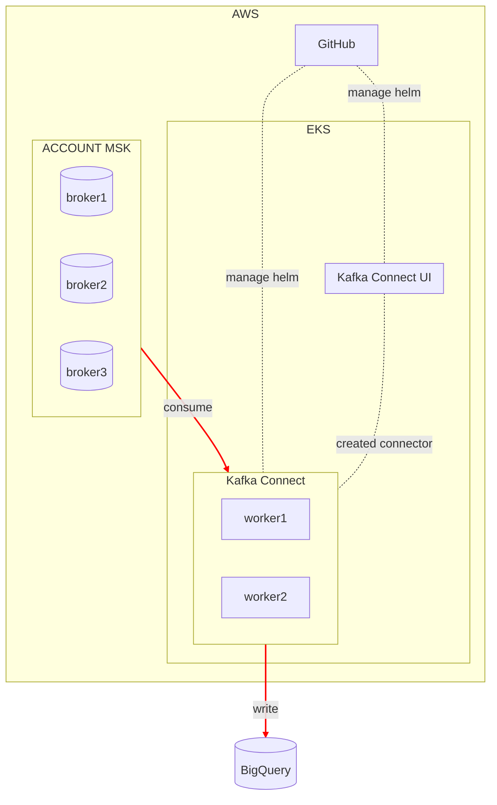

---
{"dg-publish":true,"permalink":"/data/kafka/__/migration-to-kakfa-connect/","tags":["kafka","connect"],"dgLinkPreview":true,"noteIcon":"","created":"2024-06-30T00:39:32.604+09:00"}
---

> [!tldr] 
> kafka connect 를 이용한 파이프라인 마이그레이션 (kinesis & lambda to kafka connect)

### background

- 거래소 회원 서비스의 EDA(Event Driven Architecture) 아키텍처 전환 작업이 완료되었습니다. 전환하며 카프카를 활용하게되었고, 이전에는 AWS Kinesis 를 사용중이었습니다.
- Kinesis 로 발행하는 이벤트는 도입 후 deprecated 될것이라 공유받았습니다. Kinesis 로 발행한 메세지는 lambda 를 통해 BigQuery 에 실시간으로 적재되고 있었습니다.
- Kinesis > Kafka 전환에 발맞춰 Kafka 메세지를 BigQuery 로 적재하도록 이사가기 작업이 필요했습니다.

### objective
Kinesis & Lambda 서버로그 파이프라인을 Kafka & Kafka Connect 를 이용하도록 마이그레이션 합니다.

> - 왜 카프카 커넥트였나요?
>   - kafka friendly 합니다.
>   - kafka MM(Mirror Maker) 2 버전의 경우, 내부에서 커넥트를 사용합니다. 용도(source/target) 이 다르지만 **검증된 물건**이기에 사용하기 적합하다 판단했어요.
>   - 레퍼런스가 다양합니다. 국내 빅테크를 비롯한 다양한 회사에서 외부와 카프카를 이어주는 도구로 커넥트를 적극 활용하고 있습니다. (~~흐름에 뒤쳐지기 싫은 마음도 조금은 있었어요~~)

### howto
system architecture

- 커넥트 클러스터는 [헬름 차트](https://github.com/confluentinc/cp-helm-charts/blob/master/charts/cp-kafka-connect)로 관리합니다. 소비 대상 토픽이 존재하는 MSK 클러스터를 바라볼 수 있도록 설정하고 Argo Workflow 를 통해 배포합니다. 커넥터를 생성하고 관리하는 [connect-ui](https://github.com/lensesio/kafka-connect-ui) 도 헬름차트로 관리합니다.
- 커넥터는 [BigQuery Sink Connector](https://github.com/confluentinc/kafka-connect-bigquery) 를 사용합니다.

### result
- 신뢰성 있는 서버로그 파이프라인을 제공했습니다.
  - **신뢰성이란**
    - 인프라 이슈(e.g EKS 서비스 혹은 k8s 노드 장애)를 제외한 상황 -> 한 달간 99.9& 메세지 적재성공률(SLO)을 제공했습니다. 지표는 grafana 대시보드로 구성하였고 메세지 실패 시 슬랙 알람을 발송하도록 알럿을 구성했어요.
    - 재처리 로직은 커넥트에서 dlt 로 트랜스폼에 실패한 메세지를 라우팅 할 수 있는 기능을 제공합니다. 하지만, 구성한 환경에는 적용하지 않았어요.
      - 트랜스폼에 실패한 확률은 극히 적었습니다(아예 없었어요 운영하는 기간동안). 소비하는 메세지의 스키마가 있지도 않고, 구독중인 토픽에 메세지가 잘못 쌓이지 않는 케이스가 발생하지 않았습니다. (백엔드 로직에 의해 dlt 토픽 > 원래 토픽으로 재발송)
      - 데이터 조직에서 재로직 홉을 두게 되면 오히려 **메세지를 중복 저장할 수 있다 판단**하였고, dlt 로 빠지는 케이스를 구성하지 않았어요.
- 적재실패를 대비한 모니터링과 재처리 로직을 설계했습니다. 모니터링은 특정 기간 동안의 Lag 수치를 모니터링, 임계값을 설정하여 슬랙 알람방에 발송하도록 Grafana Alert 을 관리합니다.

### keytakeaway
- 안전하게 파이프라인을 Kafka Connect 로 이관했어요.
- 카프카 생태계를 활용할 수 있는 인터페이스를 구성했어요. BigQuery 외 다른 DW 를 제공하더라도 쉽게 생성하고 관리할 수 있는 환경을 제공해요.

### more
- [[data/kafka/__/migration-target-schema\|빅쿼리로 적재할 테이블 스키마]]
- [[data/kafka/__/migration-used-packages\|사용중인 커넥터 & 트랜스폼]]
- [[data/kafka/__/migration-error-handling\|적재 실패 메세지의 처리 방안]]
- [[data/kafka/__/migration-connector-cicd\|커넥터 CI/CD]]
