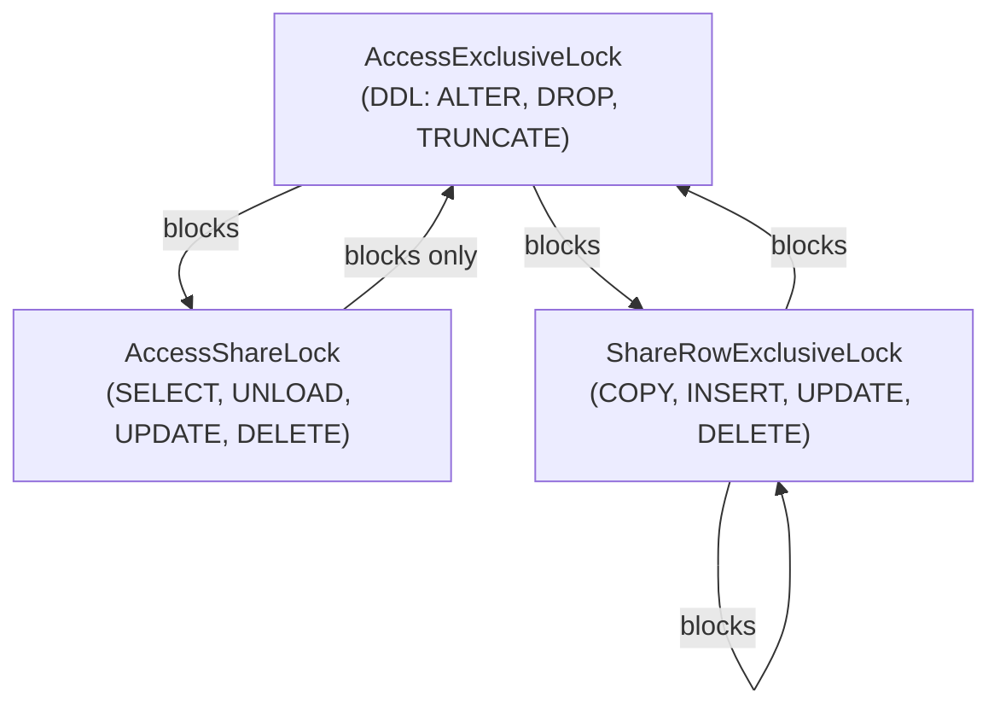

---
{"author":"jx2lee","aliases":"Redshift Lock 메커니즘","created":"2025-09-22T22:47:29.509+09:00","last-updated":"2025-09-22 22:47","tags":null,"dg-publish":true,"dg-home-link":true,"dg-show-local-graph":true,"dg-show-backlinks":false,"dg-show-toc":false,"dg-show-inline-title":false,"dg-show-file-tree":false,"dg-enable-search":true,"dg-link-preview":"ture","dg-show-tags":false,"dg-pass-frontmatter":false,"permalink":"/data/warehouse/redshift-lock/","dgHomeLink":true,"dgShowLocalGraph":true,"dgEnableSearch":true,"dgLinkPreview":"ture","dgPassFrontmatter":true,"noteIcon":""}
---

> [!info] Redshift 를 DW 로 사용하면서 배운 락 개념을 정리하고 공유한다.

> *Database Lock* 을 한 문장으로 정의하면?
> 데이터 일관성(consistence) 을 위해 트랜잭션 간 자원 접근을 제어하는 동시성(concurrency) 관리 장치 라고 이야기할 수 있다.

### Redshift Lock Types
Redshift 에서 제공하는 Lock 종류는 다음과 같다. (*문서에서 모든 락 종류를 명시하고 있지 않지만 [re-post 댓글](https://repost.aws/knowledge-center/prevent-locks-blocking-queries-redshift)을 참고해 알 수 있다. 혹은 SVV_TRANSACTION 시스템 뷰로 확인 가능하다.*) 그리고 Redshift Lock 대상 오브젝트의 단위는 테이블(조금 더 확인해봐야함) 이다. 
> `AccessExclusiveLock` blocks all other locking attempts and is obtained primarily during DDL operations, such as ALTER TABLE, DROP, or TRUNCATE.
> 
> `AccessShareLock` blocks only AccessExclusiveLock attempts and is obtained during UNLOAD, SELECT, UPDATE, or DELETE operations. AccessShareLock doesn't block other sessions that try to read or write on the table.
> 
> `ShareRowExclusiveLock` blocks AccessExclusiveLock and other ShareRowExclusiveLock attempts but doesn't block AccessShareLock attempts. ShareRowExclusiveLock is obtained during COPY, INSERT, UPDATE, or DELETE operations.

- AccessExclusiveLock: 모든 Redshift Lock 획득 시도를 차단하는 Lock. ALTER TABLE, DROP 혹은 TRUNCATE 와 같은 DDL 작업을 시도하면 이 락을 획득할 수 있음
- AccessShareLock: AccessExclusiveLock 획득 시도만을 차단하는, **UNLOAD/SELECT/UPDATE/DELETE** 연산 중 획득하는 Lock. 다른 세션에서 테이블에 읽고 쓰는 작업을 차단하지 않음
- ShareRowExclusiveLock: AccessExclusiveLock 와 다른 ShareRowExclusiveLock 획득 시도를 차단하지만 AccessShareLock 획득 시도를 차단하지 않는 Lock. COPY/INSERT/UPDATE 혹은 DELETE 작업에 이 락을 획득함

어으 뭔가 AWS 레드시프트 락이 정확히 무엇이 있는지 공식문서에 나와있지가 않다. (~~내일 서포트에 문의할 예정~~) 우선 검색된 내용을 바탕으로 작성했고 mermaid 다이어그램으로 그려봤다. relational database 에 비교해 생각해보면 AccessShareLock 은 읽기 잠금(shared lock)이고 AccessExclusiveLock 은 쓰기 잠금(exclusive lock), ShareRowExclusiveLock 은 조금 애매하지만 행 기반 쓰기 잠금(row exclusive lock)으로 볼 수 있다.

그럼 각각 락이 정말 그렇게 동작하는지 IDE 로 다중 세션을 생성, 테스트해보면 다음과 같은 결과를 확인할 수 있다.

### 내가 겪은 문제점
장기 수행 select(*트랜잭션 A라 하자*) 로 AccesShareLock 을 획득한 테이블 <-- 다른 트랜잭션(*트랜잭션 B라 하자*)이 DDL 로 인해 AccessExclusiveLock 을 획득하려고 할 때
- Q. 왜 다른 트랜잭션에서 AccessExclusiveLock 을 획득하려고 했나?
      A. 다른 트랜잭션은 ELT 로 원본을 특정 스키마에 쌓는다. 이때, FULL LOAD 방식으로 수집하는 경우 쿼리에 DDL TRUNCATE 를 포함하고 있다. 장시간 실행하는 SELECT > AccessShareLock 을 획득한 테이블을 EL트랜잭션이 AccessExclusiveLock 을 획득하려다 계속 대기하고 있었다.
- Q. 왜 이 문제가 업무시간에 발생되었나?
  A. 전일자 미수행 배치로 업무시간에 ETL 파이프라인이 실행되었다.
- Q. 그럼 이 문제를 해결할 방법은 없는가?
  A. 사용자 쿼리 대상과 ETL 영역의 레이어를 분리하면 문제없다. 사용자는 ETL 로 쌓인 테이블을 그대로 보는게 아닌, 원본 <> {다른 스키마에 다른 테이블 혹은 뷰 테이블} 일대일 매핑되는 무언가를 바라보게 분리하면 된다. 아직 이 작업이 진행되지 않았기에 이러한 문제가 발생했다.

### References
- https://en.wikipedia.org/wiki/Lock_(computer_science)#Database_locks