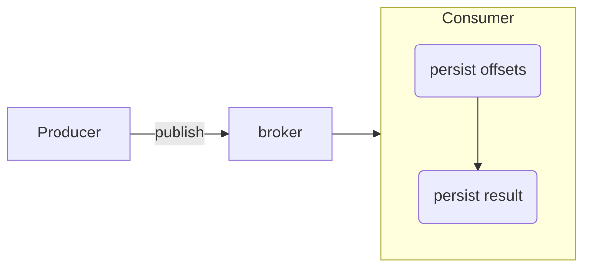

---
{"dg-publish":true,"permalink":"/delivery-semantics/","tags":["stream","delivery","semantics"],"dgHomeLink":true,"dgShowInlineTitle":true,"dgEnableSearch":true,"dgLinkPreview":true,"dgShowTags":true,"noteIcon":"","created":"2024-07-21T15:30:23.591+09:00"}
---

> [!info]
> Delivery Semantics 종류와 개념을 자꾸 깜빡, 이를 정리한다.

### delivery semantics 사전적 의미
- 프로그래밍에서 `semantic `은 코드조각의 의미^[https://developer.mozilla.org/ko/docs/Glossary/Semantics] 를 나타낸다.
- delivery semantic 은 스트리밍 애플리케이션이 원천에서 목적지까지 이벤트 전송을 보장하는 방법을 의미^[https://www.baeldung.com/kafka-message-delivery-semantics#delivery-semantics] 한다.
- 카프카 영역에서는 브로커, 프로듀서, 컨슈머가 메시지 공유에 동의하는 방식을 의미^[https://docs.confluent.io/kafka/design/delivery-semantics.html#message-delivery-guarantees] 한다.

### types

`At most once: 최대 한 번` 
- 메세지를 **한 번만 발행 혹은 소비**하며, 시스템 장애가 발생하면 발행 혹은 소비된 메세지가 손실될 수 있다.
- **손실된 메세지를 다시 발행 혹은 소비하지 않는다.**
- **데이터 손실이 문제가 되지 않고 정확도가 필수가 아닌 상황**에서 사용하는 것이 좋다.
- `enable.auto.commit = true`

`At least once: 적어도 한 번`
- 메세지를 **한 번 이상 발행 혹은 소비**한다. 시스템 장애가 발생하더라도 메세지는 손실되지 않는다.
- 단, 두 번 이상 발행 혹은 소비할 수 있다. 중복 메세지를 발행 혹은 소비할 수 있다.

`Exactly once: 정확히 한 번`
- 메세지를 정확히 한 번 전달한다. 시스템 장애가 발생하더라도 메세지가 손실되거나 두 번 소비 혹은 발행되지 않는다.

