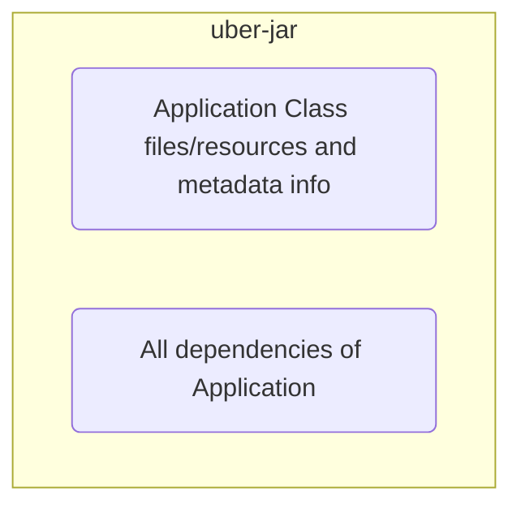

---
{"author":"jx2lee","aliases":"uber jar","created":"2024-10-27T22:09:15.000+09:00","last-updated":"2024-10-27 22:09","tags":["java","jar","uber-jar"],"dg-publish":true,"dg-home-link":true,"dg-show-local-graph":true,"dg-show-backlinks":false,"dg-show-toc":false,"dg-show-inline-title":false,"dg-show-file-tree":false,"dg-enable-search":true,"dg-link-preview":true,"dg-show-tags":false,"dg-pass-frontmatter":false,"permalink":"/etc/__/language/java-uber-jar/","dgHomeLink":true,"dgShowLocalGraph":true,"dgEnableSearch":true,"dgLinkPreview":true,"dgPassFrontmatter":true,"noteIcon":""}
---

> [!info] Uber Jar, or Fat Jar

- over-jar(jar is Java ARchive) -> 약간의 말장난
- 단순 jar 와 달리 `의존성을 가진 패키지들을 모두 포함함`
- 장점은 여럿 블로그들을 살펴보면 공통적으로 포함한 내용 하나가 있음
    - uber-jar 는 의존하는 패키지가 없기 때문에 대상에 의존성 설치여부를 신경 쓰지 않고 배포할 수 있음^[https://medium.com/@jmi.ajay/what-is-an-ubar-jar-and-maven-shade-plugin-2d94521c6a98]
    - 프로젝트 종속성이 실행 환경에 존재하는지 여부에 관계없이 모든 대상에 배포할 수 있음^[https://www.baeldung.com/scala/sbt-fat-jar]
- 허나 의존성들을 하나의 jar 로 뭉게버리니 (크고/특정 의존성을 제외할 수 없고/컨테이너 환경에서 매우 무거운 이미지를 생산하고/등등..^[https://medium.com/helidon/evil-of-fatjar-3c3011b4bd55])

👆그래서 `ThinJar` 키워드로 검색하면 국내 개발자들이 Springboot 를 ThinJar 형태로 빌드하는 예시를 많이 찾아볼 수 있음. 정확히 정의된 문서는 확인할 수 없었는데 현업에서 정말 많이 사용하고 있는지는 궁금함
