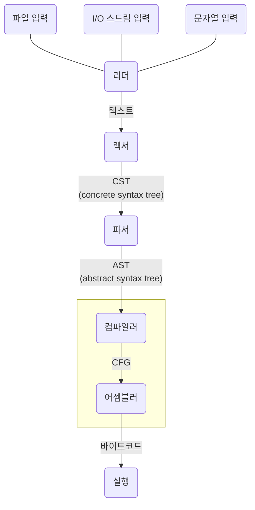
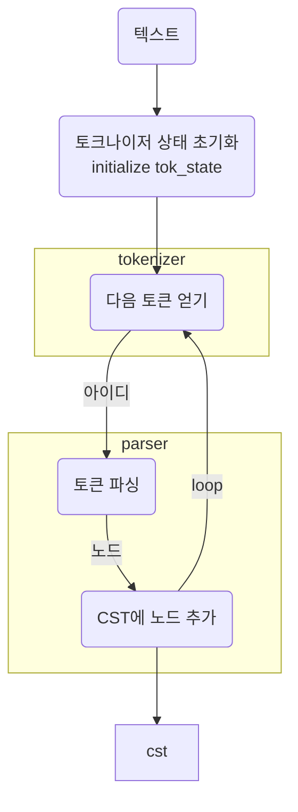
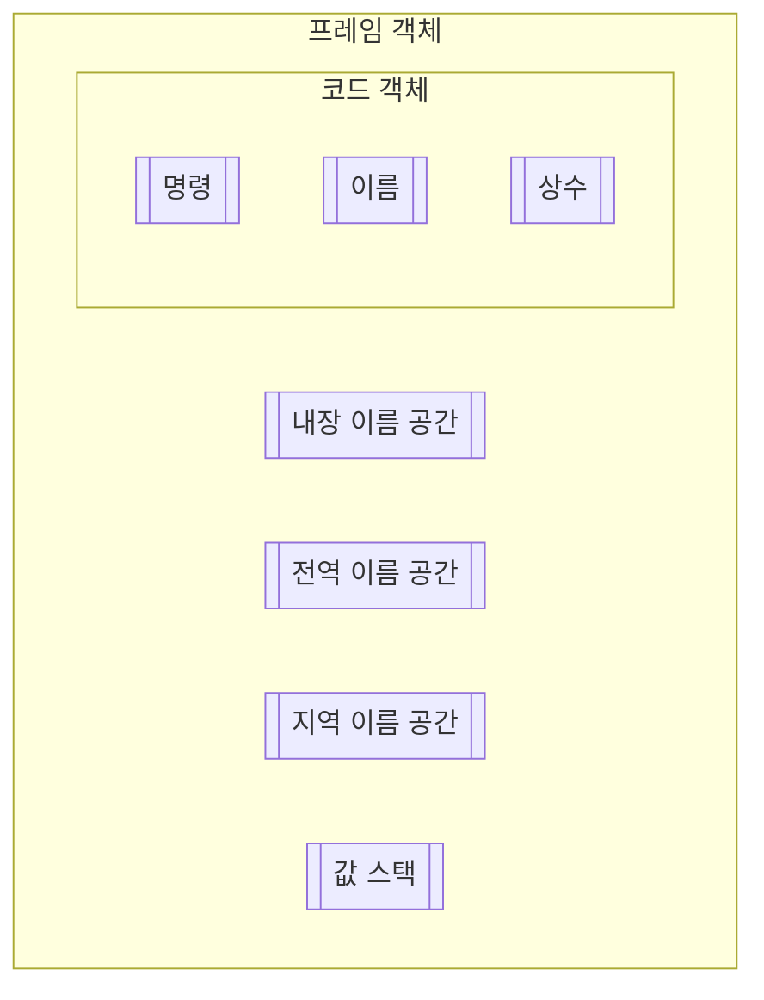
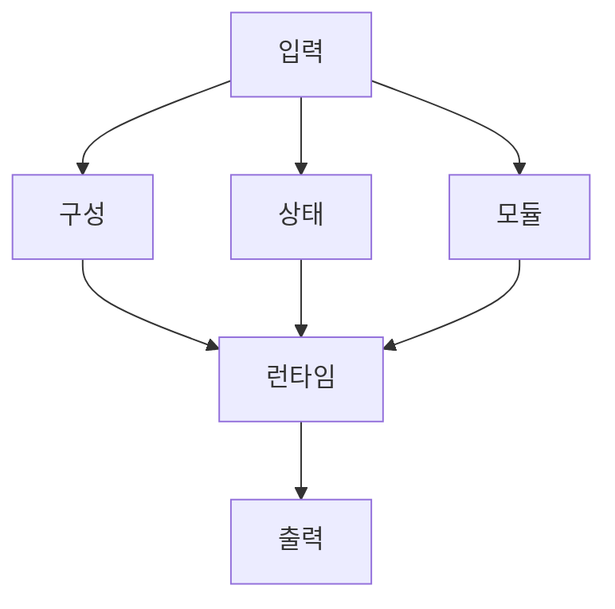
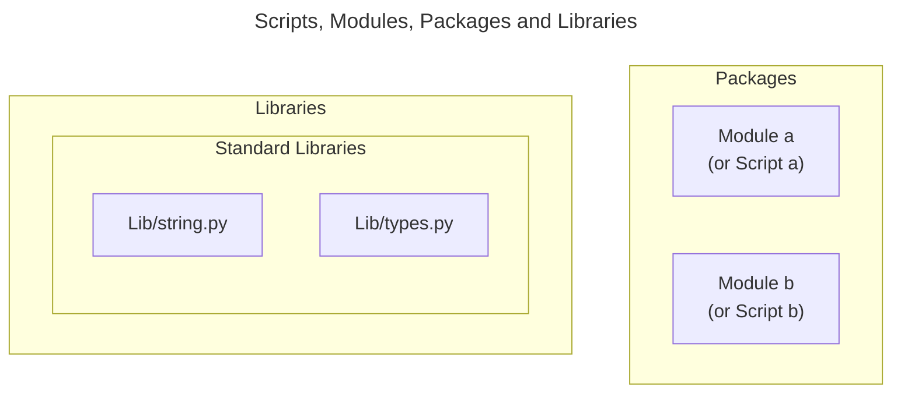

---
{"author":"jx2lee","aliases":"CPython Internals","created":"2023-12-20T00:33:04.000+09:00","last-updated":"2024-03-13 00:07","tags":["etc","python","cpython"],"dg-publish":true,"dg-home-link":true,"dg-show-local-graph":true,"dg-show-backlinks":true,"dg-show-toc":false,"dg-show-inline-title":false,"dg-show-file-tree":false,"dg-enable-search":true,"dg-link-preview":true,"dg-show-tags":true,"dg-pass-frontmatter":false,"permalink":"/notes/__/cpython-internals/","dgHomeLink":true,"dgShowBacklinks":true,"dgShowLocalGraph":true,"dgEnableSearch":true,"dgLinkPreview":true,"dgShowTags":true,"dgPassFrontmatter":true,"noteIcon":""}
---


> [!info] CPython 파헤치기 책에 나온 내용을 정리한다. [book link](https://m.yes24.com/Goods/Detail/112893907)


### Diagrams




- AST: 파이썬 문법과 문장들에 대한 **문맥 있는 트리 표현**
- CST: 토큰과 심벌에 대한 **문맥 없는 트리 표현**


#### 루프에서 파서와 토크나이저를 호출하는 과정





#### PyFrameObject





### 동시성 모델과 병렬성 모델


```mermaid
```

### glossary


- 마샬링: 파일 내용을 메모리로 복사하여 특정 데이터 구조로 변환하는 것을 의미
    - more
        - https://docs.python.org/ko/3/library/marshal.html
        - https://www.geeksforgeeks.org/marshal-internal-python-object-serialization/
- 평가루트 (execution loop)
    - execution loop 늠 코드 객체를 입력받아 frame 객체를 반환한다.
    - 인터프리터는 최소 한 개 스레드를 갖는다.
    - 각 스레드는 스레드 상태를 갖는다.
    - frame 객체는 프레임 스텍(stack frame)에서 실행된다.
        - https://google.github.io/pytype/developers/frames.html#overview
        - https://realpython.com/cpython-source-code-guide/#execution
    - 값 스택에서 변수를 참조할 수 있다.
- 테스트 스위트 (Test Suite)
    - definition: 특정 테스트 실행에서 실행될 일련의 테스트 스크립트 또는 절차의 모음
    - Suite 라는 의미를 몰라 헤맸다. `모음` 이라는 의미로, 테스트 실행 집합을 의미한다.
- 회귀 테스트 (Regression Test)
    - definition: 이미 테스트된 프로그램의 테스트를 반복하는 것
        - wiki: 회귀 버그를 찾는 모든 소프트웨어 테스트 방식
        - 회귀 버그란, 이전에 제대로 동작하던 소프트웨어 기능에 문제가 생기는 것을 가리키는데 주로 프로그램 변경 중 의도치 않게 발생한다.
- forward referencing


### memory


- cpython 은 C의 동적 메모리 할당에 크게 의존한다. 가비지 컬렉션과 레퍼런스 카운팅 알고리즘을 이용한 안전장치가 존재한다.

stack & heap in Python
```mermaid
flowchart TB
    subgraph heap["Heap"]
        obj
        obj_("obj")
    end

    subgraph stack["Stack"]
        a
        b
        c
    end

    a --> obj
    b --> obj
    c --> obj_
```


### 인터프리터가 파이썬 코드를 실행하고 출력하는 과정





### Scripts, Modules, Packages, and Libraries



Links
- Module: https://docs.python.org/3/glossary.html#term-module
- Package: https://docs.python.org/3/glossary.html#term-package
- **library 는 glossary 에 없음**


### reference
- [Defining Main Functions in Python](https://realpython.com/python-main-function/)
- [How Rust and Python Manage Memory](https://blog.det.life/how-rust-and-python-manage-memory-f514adb6456a)
